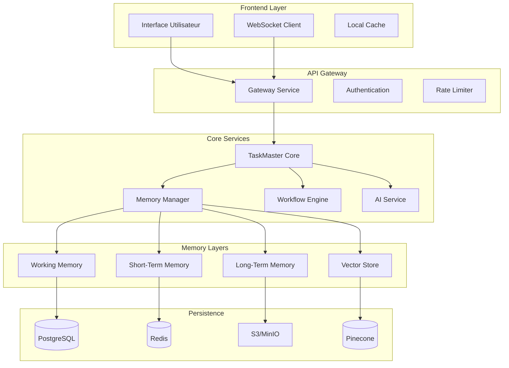

# 🚀 Guide d'Amélioration TaskMaster - Système de Mémoire Persistante Avancée

## 📋 Table des Matières

1. [Vue d'Ensemble](#vue-densemble)
2. [Architecture Proposée](#architecture-proposée)
3. [Système de Mémoire Multi-Niveaux](#système-de-mémoire-multi-niveaux)
4. [Implémentation Technique](#implémentation-technique)
5. [Gestion des Contextes](#gestion-des-contextes)
6. [Intégration avec l'Application](#intégration-avec-lapplication)
7. [Plan de Migration](#plan-de-migration)
8. [Exemples Concrets](#exemples-concrets)

## Vue d'Ensemble

### Objectifs

Ce guide détaille comment transformer TaskMaster en un système de gestion de tâches intelligent capable de :

- **Gérer des projets complexes** avec des dizaines de sections interconnectées
- **Maintenir une mémoire persistante** par module, fonction et contexte
- **Apprendre continuellement** des interactions et optimiser les workflows
- **Supporter des milliers d'utilisateurs** avec des rôles et permissions complexes

### Bénéfices Attendus

- 🔄 **Mémoire Contextuelle** : Chaque module conserve son historique et apprentissages
- 🧠 **Intelligence Augmentée** : Prédictions et suggestions basées sur l'expérience
- 🔗 **Interconnexions Intelligentes** : Gestion des dépendances complexes
- 📊 **Performance Optimisée** : Réponses rapides grâce au cache intelligent

## Architecture Proposée

### Vue d'Ensemble de l'Architecture



### Composants Principaux

#### 1. **TaskMaster Core**
- Orchestration des tâches
- Gestion des workflows
- Coordination des services

#### 2. **Memory Manager**
- Gestion hiérarchique de la mémoire
- Stratégies de persistance
- Optimisation des accès

#### 3. **Workflow Engine**
- Exécution des workflows complexes
- Gestion des dépendances
- Parallélisation intelligente

#### 4. **AI Service**
- Apprentissage continu
- Prédictions et suggestions
- Optimisation automatique

## Système de Mémoire Multi-Niveaux

### Architecture de Mémoire

```javascript
// Structure de la mémoire hiérarchique
class MemoryArchitecture {
  constructor() {
    // Niveau 1: Mémoire à court terme (Session)
    this.shortTermMemory = {
      storage: 'Redis',
      ttl: '24 hours',
      capacity: '1000 items per context',
      usage: 'Active session data, temporary calculations'
    };
    
    // Niveau 2: Mémoire de travail (Cross-session)
    this.workingMemory = {
      storage: 'PostgreSQL + Redis Cache',
      ttl: '30 days',
      capacity: '10000 items per tenant',
      usage: 'Recent patterns, frequently accessed data'
    };
    
    // Niveau 3: Mémoire à long terme (Persistent)
    this.longTermMemory = {
      storage: 'S3/MinIO + PostgreSQL metadata',
      ttl: 'Configurable (1 year default)',
      capacity: 'Unlimited',
      usage: 'Historical data, learned patterns, analytics'
    };
    
    // Niveau 4: Mémoire sémantique (Vector)
    this.semanticMemory = {
      storage: 'Pinecone/Weaviate',
      ttl: 'Permanent',
      capacity: '1M vectors per tenant',
      usage: 'Semantic search, similarity matching, AI context'
    };
  }
}
```

### Stratégies de Persistance

```javascript
class PersistenceStrategy {
  async save(context, data) {
    const importance = await this.calculateImportance(data);
    const memoryLevel = this.determineMemoryLevel(importance);
    
    switch(memoryLevel) {
      case 'SHORT_TERM':
        await this.saveToRedis(context, data, { ttl: 86400 });
        break;
        
      case 'WORKING':
        await this.saveToPostgres(context, data);
        await this.cacheInRedis(context, data, { ttl: 2592000 });
        break;
        
      case 'LONG_TERM':
        const metadata = await this.saveToS3(context, data);
        await this.indexInPostgres(context, metadata);
        break;
        
      case 'SEMANTIC':
        const embedding = await this.generateEmbedding(data);
        await this.saveToVectorStore(context, embedding, data);
        break;
    }
    
    // Propagation aux niveaux supérieurs si nécessaire
    if (importance > 0.8) {
      await this.propagateToHigherLevels(context, data, memoryLevel);
    }
  }
  
  calculateImportance(data) {
    // Facteurs d'importance
    const factors = {
      frequency: this.getAccessFrequency(data),
      recency: this.getRecencyScore(data),
      businessValue: this.getBusinessValue(data),
      userImportance: this.getUserImportanceScore(data),
      complexity: this.getComplexityScore(data)
    };
    
    // Calcul pondéré
    return Object.values(factors).reduce((sum, score) => sum + score) / Object.keys(factors).length;
  }
}
```

## Implémentation Technique

### 1. Memory Manager Avancé

```javascript
// taskmaster/memory/MemoryManager.js
const { EventEmitter } = require('events');
const Redis = require('ioredis');
const { Pool } = require('pg');
const AWS = require('aws-sdk');
const { PineconeClient } = require('@pinecone-database/pinecone');

class AdvancedMemoryManager extends EventEmitter {
  constructor(config) {
    super();
    this.config = config;
    this.contexts = new Map();
    this.initializeStorages();
  }
  
  async initializeStorages() {
    // Redis pour cache et short-term
    this.redis = new Redis({
      host: this.config.redis.host,
      port: this.config.redis.port,
      password: this.config.redis.password,
      keyPrefix: 'taskmaster:'
    });
    
    // PostgreSQL pour working memory
    this.pg = new Pool({
      host: this.config.postgres.host,
      database: this.config.postgres.database,
      user: this.config.postgres.user,
      password: this.config.postgres.password
    });
    
    // S3 pour long-term storage
    this.s3 = new AWS.S3({
      endpoint: this.config.s3.endpoint,
      accessKeyId: this.config.s3.accessKey,
      secretAccessKey: this.config.s3.secretKey
    });
    
    // Pinecone pour vector store
    this.pinecone = new PineconeClient();
    await this.pinecone.init({
      apiKey: this.config.pinecone.apiKey,
      environment: this.config.pinecone.environment
    });
    
    this.vectorIndex = this.pinecone.Index('taskmaster-memories');
  }
  
  // Créer ou récupérer un contexte
  async getContext(contextId, options = {}) {
    if (!this.contexts.has(contextId)) {
      const context = new MemoryContext(contextId, {
        ...options,
        manager: this
      });
      await context.initialize();
      this.contexts.set(contextId, context);
    }
    return this.contexts.get(contextId);
  }
  
  // Sauvegarder dans le contexte approprié
  async remember(contextId, key, value, options = {}) {
    const context = await this.getContext(contextId);
    const memory = {
      key,
      value,
      timestamp: new Date(),
      metadata: options.metadata || {},
      importance: options.importance || await this.calculateImportance(value),
      ttl: options.ttl
    };
    
    // Sauvegarder selon l'importance
    if (memory.importance >= 0.9) {
      await this.saveToAllLevels(context, memory);
    } else if (memory.importance >= 0.7) {
      await this.saveToLongTerm(context, memory);
    } else if (memory.importance >= 0.5) {
      await this.saveToWorking(context, memory);
    } else {
      await this.saveToShortTerm(context, memory);
    }
    
    // Émettre événement pour analytics
    this.emit('memory:saved', { contextId, key, importance: memory.importance });
    
    return memory;
  }
  
  // Rappeler depuis le contexte
  async recall(contextId, query, options = {}) {
    const context = await this.getContext(contextId);
    
    // Recherche multi-niveaux avec fallback
    let result = null;
    
    // 1. Vérifier short-term memory
    result = await this.searchShortTerm(context, query);
    if (result && this.isResultSatisfactory(result, options)) {
      return result;
    }
    
    // 2. Vérifier working memory
    result = await this.searchWorking(context, query);
    if (result && this.isResultSatisfactory(result, options)) {
      // Promouvoir en short-term pour accès rapide
      await this.promoteToShortTerm(context, result);
      return result;
    }
    
    // 3. Vérifier long-term memory
    result = await this.searchLongTerm(context, query);
    if (result && this.isResultSatisfactory(result, options)) {
      // Promouvoir en working memory
      await this.promoteToWorking(context, result);
      return result;
    }
    
    // 4. Recherche sémantique si enabled
    if (options.semantic !== false) {
      result = await this.searchSemantic(context, query);
      if (result) {
        // Promouvoir selon pertinence
        await this.promoteBasedOnRelevance(context, result);
        return result;
      }
    }
    
    return null;
  }
  
  // Apprentissage et optimisation
  async learn(contextId, pattern, outcome) {
    const context = await this.getContext(contextId);
    const learning = {
      pattern,
      outcome,
      timestamp: new Date(),
      contextId
    };
    
    // Stocker l'apprentissage
    await this.saveLearning(context, learning);
    
    // Mettre à jour les modèles
    await this.updateModels(context, learning);
    
    // Optimiser les accès futurs
    await this.optimizeAccessPatterns(context, pattern);
    
    this.emit('memory:learned', { contextId, pattern, outcome });
  }
  
  // Consolidation de mémoire (processus de fond)
  async consolidateMemories() {
    for (const [contextId, context] of this.contexts) {
      try {
        // Identifier patterns fréquents
        const patterns = await this.identifyPatterns(context);
        
        // Compresser données similaires
        await this.compressSimilar(context, patterns);
        
        // Archiver mémoires obsolètes
        await this.archiveObsolete(context);
        
        // Générer embeddings pour nouvelles données
        await this.generateEmbeddings(context);
        
      } catch (error) {
        console.error(`Consolidation failed for context ${contextId}:`, error);
      }
    }
  }
}

// Contexte de mémoire spécifique
class MemoryContext {
  constructor(id, options) {
    this.id = id;
    this.options = options;
    this.manager = options.manager;
    this.metadata = {};
    this.accessPatterns = new Map();
  }
  
  async initialize() {
    // Charger métadonnées du contexte
    const metadata = await this.manager.pg.query(
      'SELECT * FROM memory_contexts WHERE id = $1',
      [this.id]
    );
    
    if (metadata.rows.length > 0) {
      this.metadata = metadata.rows[0];
    } else {
      // Créer nouveau contexte
      await this.manager.pg.query(
        'INSERT INTO memory_contexts (id, created_at, metadata) VALUES ($1, $2, $3)',
        [this.id, new Date(), JSON.stringify({})]
      );
    }
    
    // Charger patterns d'accès
    await this.loadAccessPatterns();
  }
  
  async loadAccessPatterns() {
    const patterns = await this.manager.redis.get(`patterns:${this.id}`);
    if (patterns) {
      this.accessPatterns = new Map(JSON.parse(patterns));
    }
  }
  
  async updateAccessPattern(key, metadata = {}) {
    const pattern = this.accessPatterns.get(key) || {
      count: 0,
      lastAccess: null,
      avgResponseTime: 0
    };
    
    pattern.count++;
    pattern.lastAccess = new Date();
    pattern.metadata = { ...pattern.metadata, ...metadata };
    
    this.accessPatterns.set(key, pattern);
    
    // Sauvegarder périodiquement
    if (pattern.count % 10 === 0) {
      await this.manager.redis.set(
        `patterns:${this.id}`,
        JSON.stringify([...this.accessPatterns]),
        'EX',
        86400 * 7 // 7 jours
      );
    }
  }
}

module.exports = AdvancedMemoryManager;
```

### 2. Intégration avec TaskMaster

```javascript
// taskmaster/enhanced-taskmaster-service.js
const { TaskmasterService } = require('./taskmaster-service');
const AdvancedMemoryManager = require('./memory/MemoryManager');
const WorkflowOrchestrator = require('./workflow/WorkflowOrchestrator');
const AIService = require('./ai/AIService');

class EnhancedTaskmasterService extends TaskmasterService {
  constructor(config) {
    super(config);
    
    // Initialiser les nouveaux composants
    this.memoryManager = new AdvancedMemoryManager(config.memory);
    this.orchestrator = new WorkflowOrchestrator(this);
    this.aiService = new AIService(config.ai);
    
    // Contextes par module
    this.moduleContexts = new Map();
    
    // Métriques avancées
    this.advancedMetrics = {
      contextSwitches: 0,
      memoryHits: 0,
      memoryMisses: 0,
      aiPredictions: 0,
      learningCycles: 0
    };
    
    this.setupEnhancements();
  }
  
  setupEnhancements() {
    // Event listeners pour apprentissage
    this.on('task:completed', async (task) => {
      await this.learnFromCompletion(task);
    });
    
    this.on('workflow:completed', async (workflow) => {
      await this.learnFromWorkflow(workflow);
    });
    
    // Consolidation périodique
    setInterval(() => {
      this.consolidateMemories();
    }, 3600000); // Toutes les heures
  }
  
  // Override: Créer tâche avec contexte
  async createTask(data) {
    const contextId = this.getContextId(data);
    const context = await this.memoryManager.getContext(contextId);
    
    // Récupérer suggestions basées sur l'historique
    const suggestions = await this.aiService.suggestTaskParams(context, data);
    
    // Enrichir les données avec suggestions
    const enrichedData = {
      ...data,
      ...suggestions,
      metadata: {
        ...data.metadata,
        contextId,
        suggestedBy: 'AI',
        confidence: suggestions.confidence
      }
    };
    
    // Créer la tâche
    const task = await super.createTask(enrichedData);
    
    // Mémoriser la création
    await this.memoryManager.remember(contextId, `task:${task.id}`, {
      type: 'creation',
      data: enrichedData,
      result: task
    });
    
    return task;
  }
  
  // Override: Exécuter tâche avec apprentissage
  async executeTask(taskId) {
    const task = await this.getTask(taskId);
    const contextId = this.getContextId(task);
    const context = await this.memoryManager.getContext(contextId);
    
    // Prédiction de performance
    const prediction = await this.aiService.predictPerformance(context, task);
    
    // Optimisation basée sur prédiction
    if (prediction.expectedDuration > task.estimatedTime * 1.5) {
      await this.optimizeTaskExecution(task, prediction);
    }
    
    // Exécution avec monitoring
    const startTime = Date.now();
    const result = await super.executeTask(taskId);
    const duration = Date.now() - startTime;
    
    // Apprentissage
    await this.learnFromExecution(context, task, result, duration, prediction);
    
    return result;
  }
  
  // Nouvelle méthode: Exécuter workflow avec orchestration
  async executeWorkflowEnhanced(workflowId, options = {}) {
    const workflow = await this.getWorkflow(workflowId);
    const contextId = `workflow:${workflow.type}:${workflow.wedding_id}`;
    const context = await this.memoryManager.getContext(contextId);
    
    // Analyse des dépendances et optimisation
    const executionPlan = await this.orchestrator.planExecution(workflow, context);
    
    // Exécution parallèle intelligente
    const results = await this.orchestrator.executeParallel(executionPlan, {
      onTaskComplete: async (task, result) => {
        await this.memoryManager.remember(contextId, `execution:${task.id}`, {
          task,
          result,
          timestamp: new Date()
        });
      },
      onError: async (task, error) => {
        await this.handleExecutionError(context, task, error);
      }
    });
    
    // Consolidation des résultats
    const summary = await this.consolidateResults(workflow, results);
    
    // Apprentissage du workflow complet
    await this.learnFromWorkflow(context, workflow, summary);
    
    return summary;
  }
  
  // Générer ID de contexte selon la hiérarchie
  getContextId(data) {
    // Hiérarchie: global > tenant > module > function
    const parts = ['taskmaster'];
    
    if (data.wedding_id) {
      parts.push(`wedding:${data.wedding_id}`);
    }
    
    if (data.module) {
      parts.push(`module:${data.module}`);
    }
    
    if (data.function) {
      parts.push(`function:${data.function}`);
    }
    
    return parts.join(':');
  }
  
  // Apprentissage à partir des complétions
  async learnFromCompletion(task) {
    const contextId = this.getContextId(task);
    const pattern = {
      type: task.type,
      duration: task.completedAt - task.startedAt,
      success: task.status === 'completed',
      metadata: task.metadata
    };
    
    await this.memoryManager.learn(contextId, pattern, {
      performance: this.calculatePerformanceScore(task),
      insights: await this.extractInsights(task)
    });
  }
  
  // Apprentissage à partir des workflows
  async learnFromWorkflow(context, workflow, summary) {
    const pattern = {
      workflowType: workflow.type,
      taskCount: workflow.tasks.length,
      duration: summary.totalDuration,
      parallelism: summary.maxParallelTasks,
      criticalPath: summary.criticalPath
    };
    
    await this.memoryManager.learn(context.id, pattern, {
      efficiency: summary.efficiency,
      bottlenecks: summary.bottlenecks,
      optimizations: summary.suggestedOptimizations
    });
  }
  
  // Optimisation basée sur l'apprentissage
  async optimizeTaskExecution(task, prediction) {
    const contextId = this.getContextId(task);
    const optimizations = await this.aiService.suggestOptimizations(contextId, task, prediction);
    
    // Appliquer optimisations
    if (optimizations.parallelism) {
      task.parallel = true;
      task.maxConcurrent = optimizations.parallelism;
    }
    
    if (optimizations.caching) {
      task.cache = {
        enabled: true,
        ttl: optimizations.cacheTTL
      };
    }
    
    if (optimizations.priority) {
      task.priority = optimizations.priority;
    }
    
    await this.updateTask(task.id, task);
  }
  
  // Méthodes de recherche avancée
  async searchMemory(query, options = {}) {
    const contexts = options.contexts || [...this.moduleContexts.keys()];
    const results = [];
    
    for (const contextId of contexts) {
      const contextResults = await this.memoryManager.recall(contextId, query, {
        semantic: options.semantic !== false,
        limit: options.limit || 10,
        minScore: options.minScore || 0.7
      });
      
      if (contextResults) {
        results.push({
          contextId,
          results: contextResults
        });
      }
    }
    
    // Trier par pertinence
    return results.sort((a, b) => b.results.score - a.results.score);
  }
  
  // Export des insights
  async generateInsights(period = '7d') {
    const insights = {
      performance: await this.analyzePerformance(period),
      patterns: await this.identifyPatterns(period),
      predictions: await this.generatePredictions(),
      recommendations: await this.generateRecommendations()
    };
    
    return insights;
  }
}

module.exports = EnhancedTaskmasterService;
```

## Gestion des Contextes

### Hiérarchie des Contextes

```javascript
// Configuration des contextes par module
const contextHierarchy = {
  global: {
    id: 'taskmaster:global',
    retention: '1y',
    children: ['tenants']
  },
  
  tenants: {
    pattern: 'taskmaster:wedding:{weddingId}',
    retention: '2y',
    children: ['modules']
  },
  
  modules: {
    wedding: {
      pattern: 'taskmaster:wedding:{weddingId}:module:wedding',
      retention: '2y',
      children: ['planning', 'vendors', 'guests', 'budget'],
      sharedMemory: ['vendors', 'budget']
    },
    
    vendors: {
      pattern: 'taskmaster:wedding:{weddingId}:module:vendors',
      retention: '3y',
      children: ['categories'],
      sharedMemory: ['wedding', 'budget']
    },
    
    guests: {
      pattern: 'taskmaster:wedding:{weddingId}:module:guests',
      retention: '1y',
      children: ['invitations', 'seating', 'dietary'],
      sharedMemory: ['wedding']
    },
    
    budget: {
      pattern: 'taskmaster:wedding:{weddingId}:module:budget',
      retention: '3y',
      children: ['categories', 'transactions'],
      sharedMemory: ['wedding', 'vendors']
    }
  },
  
  functions: {
    pattern: 'taskmaster:wedding:{weddingId}:module:{module}:function:{function}',
    retention: '1y',
    inheritFromParent: true
  }
};
```

### Partage de Mémoire Inter-Modules

```javascript
class ContextSharingManager {
  constructor(memoryManager) {
    this.memoryManager = memoryManager;
    this.sharingRules = new Map();
    this.setupDefaultRules();
  }
  
  setupDefaultRules() {
    // Règles de partage par défaut
    this.addSharingRule('vendors', 'budget', {
      types: ['pricing', 'contracts', 'payments'],
      bidirectional: true
    });
    
    this.addSharingRule('wedding', 'all', {
      types: ['timeline', 'overview'],
      bidirectional: false
    });
    
    this.addSharingRule('guests', 'vendors', {
      types: ['dietary_requirements', 'special_needs'],
      transform: this.transformGuestDataForVendors
    });
  }
  
  async shareMemory(sourceContext, targetContext, data, options = {}) {
    const rule = this.findApplicableRule(sourceContext, targetContext);
    
    if (!rule) {
      throw new Error(`No sharing rule between ${sourceContext} and ${targetContext}`);
    }
    
    // Transformer les données si nécessaire
    const transformedData = rule.transform 
      ? await rule.transform(data, options)
      : data;
    
    // Vérifier les permissions
    if (!this.hasPermission(sourceContext, targetContext, transformedData.type)) {
      throw new Error('Permission denied for memory sharing');
    }
    
    // Partager la mémoire
    await this.memoryManager.remember(targetContext, `shared:${sourceContext}:${data.key}`, {
      ...transformedData,
      sharedFrom: sourceContext,
      sharedAt: new Date(),
      sharingRule: rule.id
    });
    
    // Partage bidirectionnel si configuré
    if (rule.bidirectional) {
      await this.memoryManager.remember(sourceContext, `shared:${targetContext}:${data.key}`, {
        reference: targetContext,
        sharedAt: new Date()
      });
    }
  }
  
  // Recherche cross-context
  async searchAcrossContexts(query, contexts, options = {}) {
    const results = new Map();
    
    // Recherche parallèle dans tous les contextes
    const searches = contexts.map(async (context) => {
      const contextResults = await this.memoryManager.recall(context, query, {
        ...options,
        includeShared: true
      });
      
      return { context, results: contextResults };
    });
    
    const allResults = await Promise.all(searches);
    
    // Agréger et dédupliquer
    for (const { context, results: contextResults } of allResults) {
      if (contextResults) {
        for (const result of contextResults) {
          const key = this.generateResultKey(result);
          
          if (!results.has(key) || results.get(key).score < result.score) {
            results.set(key, {
              ...result,
              contexts: [...(results.get(key)?.contexts || []), context]
            });
          }
        }
      }
    }
    
    // Retourner trié par score
    return Array.from(results.values())
      .sort((a, b) => b.score - a.score)
      .slice(0, options.limit || 50);
  }
}
```

## Intégration avec l'Application

### 1. API Routes Avancées

```javascript
// routes/api/taskmaster-enhanced.js
const express = require('express');
const router = express.Router();

// Routes pour la mémoire
router.post('/memory/save', async (req, res) => {
  try {
    const { contextId, key, value, options } = req.body;
    const memory = await taskmaster.memoryManager.remember(
      contextId,
      key,
      value,
      options
    );
    res.json({ success: true, memory });
  } catch (error) {
    res.status(500).json({ error: error.message });
  }
});

router.get('/memory/recall', async (req, res) => {
  try {
    const { contextId, query, semantic } = req.query;
    const results = await taskmaster.memoryManager.recall(
      contextId,
      query,
      { semantic: semantic === 'true' }
    );
    res.json({ success: true, results });
  } catch (error) {
    res.status(500).json({ error: error.message });
  }
});

router.post('/memory/search', async (req, res) => {
  try {
    const { query, contexts, options } = req.body;
    const results = await taskmaster.searchMemory(query, {
      contexts,
      ...options
    });
    res.json({ success: true, results });
  } catch (error) {
    res.status(500).json({ error: error.message });
  }
});

// Routes pour les workflows avancés
router.post('/workflows/:id/execute-enhanced', async (req, res) => {
  try {
    const { id } = req.params;
    const { options } = req.body;
    const result = await taskmaster.executeWorkflowEnhanced(id, options);
    res.json({ success: true, result });
  } catch (error) {
    res.status(500).json({ error: error.message });
  }
});

// Routes pour les insights
router.get('/insights', async (req, res) => {
  try {
    const { period } = req.query;
    const insights = await taskmaster.generateInsights(period);
    res.json({ success: true, insights });
  } catch (error) {
    res.status(500).json({ error: error.message });
  }
});

module.exports = router;
```

### 2. Hook React Avancé

```javascript
// hooks/useEnhancedTaskmaster.js
import { useState, useEffect, useCallback, useRef } from 'react';
import { useWebSocket } from './useWebSocket';

export function useEnhancedTaskmaster(weddingId) {
  const [memories, setMemories] = useState({});
  const [insights, setInsights] = useState(null);
  const [searchResults, setSearchResults] = useState([]);
  const contextCache = useRef(new Map());
  
  const ws = useWebSocket('/taskmaster-ws');
  
  // Sauvegarder dans la mémoire
  const remember = useCallback(async (contextId, key, value, options = {}) => {
    try {
      const response = await fetch('/api/taskmaster/memory/save', {
        method: 'POST',
        headers: { 'Content-Type': 'application/json' },
        body: JSON.stringify({ contextId, key, value, options })
      });
      
      const result = await response.json();
      if (result.success) {
        setMemories(prev => ({
          ...prev,
          [contextId]: {
            ...prev[contextId],
            [key]: result.memory
          }
        }));
      }
      
      return result;
    } catch (error) {
      console.error('Failed to save memory:', error);
      throw error;
    }
  }, []);
  
  // Rappeler depuis la mémoire
  const recall = useCallback(async (contextId, query, options = {}) => {
    // Vérifier le cache d'abord
    const cacheKey = `${contextId}:${query}`;
    if (contextCache.current.has(cacheKey)) {
      return contextCache.current.get(cacheKey);
    }
    
    try {
      const params = new URLSearchParams({
        contextId,
        query,
        semantic: options.semantic || false
      });
      
      const response = await fetch(`/api/taskmaster/memory/recall?${params}`);
      const result = await response.json();
      
      if (result.success) {
        // Mettre en cache
        contextCache.current.set(cacheKey, result.results);
        
        // Nettoyer le cache après 5 minutes
        setTimeout(() => {
          contextCache.current.delete(cacheKey);
        }, 300000);
        
        return result.results;
      }
      
      return null;
    } catch (error) {
      console.error('Failed to recall memory:', error);
      return null;
    }
  }, []);
  
  // Recherche avancée
  const searchMemory = useCallback(async (query, options = {}) => {
    try {
      const response = await fetch('/api/taskmaster/memory/search', {
        method: 'POST',
        headers: { 'Content-Type': 'application/json' },
        body: JSON.stringify({
          query,
          contexts: options.contexts || [`wedding:${weddingId}`],
          options
        })
      });
      
      const result = await response.json();
      if (result.success) {
        setSearchResults(result.results);
        return result.results;
      }
      
      return [];
    } catch (error) {
      console.error('Search failed:', error);
      return [];
    }
  }, [weddingId]);
  
  // Exécuter workflow avancé
  const executeWorkflow = useCallback(async (workflowId, options = {}) => {
    try {
      const response = await fetch(
        `/api/taskmaster/workflows/${workflowId}/execute-enhanced`,
        {
          method: 'POST',
          headers: { 'Content-Type': 'application/json' },
          body: JSON.stringify({ options })
        }
      );
      
      const result = await response.json();
      return result;
    } catch (error) {
      console.error('Workflow execution failed:', error);
      throw error;
    }
  }, []);
  
  // Obtenir les insights
  const fetchInsights = useCallback(async (period = '7d') => {
    try {
      const response = await fetch(`/api/taskmaster/insights?period=${period}`);
      const result = await response.json();
      
      if (result.success) {
        setInsights(result.insights);
        return result.insights;
      }
      
      return null;
    } catch (error) {
      console.error('Failed to fetch insights:', error);
      return null;
    }
  }, []);
  
  // WebSocket listeners
  useEffect(() => {
    if (!ws) return;
    
    ws.on('memory:updated', (data) => {
      if (data.contextId.includes(weddingId)) {
        setMemories(prev => ({
          ...prev,
          [data.contextId]: {
            ...prev[data.contextId],
            [data.key]: data.memory
          }
        }));
      }
    });
    
    ws.on('insight:generated', (data) => {
      if (data.weddingId === weddingId) {
        setInsights(data.insights);
      }
    });
    
    return () => {
      ws.off('memory:updated');
      ws.off('insight:generated');
    };
  }, [ws, weddingId]);
  
  return {
    // Mémoire
    memories,
    remember,
    recall,
    searchMemory,
    searchResults,
    
    // Workflows
    executeWorkflow,
    
    // Insights
    insights,
    fetchInsights,
    
    // Utils
    clearCache: () => contextCache.current.clear()
  };
}
```

### 3. Composant Dashboard Avancé

```jsx
// components/TaskmasterDashboard.jsx
import React, { useState, useEffect } from 'react';
import { Card, Tabs, Tab, Grid, Typography } from '@mui/material';
import { useEnhancedTaskmaster } from '../hooks/useEnhancedTaskmaster';
import MemoryExplorer from './MemoryExplorer';
import WorkflowVisualizer from './WorkflowVisualizer';
import InsightsPanel from './InsightsPanel';
import TaskPredictions from './TaskPredictions';

export default function TaskmasterDashboard({ weddingId }) {
  const [activeTab, setActiveTab] = useState(0);
  const taskmaster = useEnhancedTaskmaster(weddingId);
  
  useEffect(() => {
    // Charger les insights au montage
    taskmaster.fetchInsights('30d');
  }, []);
  
  return (
    <Card>
      <Tabs value={activeTab} onChange={(e, v) => setActiveTab(v)}>
        <Tab label="Vue d'ensemble" />
        <Tab label="Mémoire" />
        <Tab label="Workflows" />
        <Tab label="Insights" />
        <Tab label="Prédictions" />
      </Tabs>
      
      {activeTab === 0 && (
        <Grid container spacing={3} p={3}>
          <Grid item xs={12} md={6}>
            <TaskSummary weddingId={weddingId} />
          </Grid>
          <Grid item xs={12} md={6}>
            <PerformanceMetrics insights={taskmaster.insights} />
          </Grid>
          <Grid item xs={12}>
            <RecentActivity weddingId={weddingId} />
          </Grid>
        </Grid>
      )}
      
      {activeTab === 1 && (
        <MemoryExplorer 
          memories={taskmaster.memories}
          onSearch={taskmaster.searchMemory}
          searchResults={taskmaster.searchResults}
        />
      )}
      
      {activeTab === 2 && (
        <WorkflowVisualizer 
          weddingId={weddingId}
          onExecute={taskmaster.executeWorkflow}
        />
      )}
      
      {activeTab === 3 && (
        <InsightsPanel 
          insights={taskmaster.insights}
          onRefresh={() => taskmaster.fetchInsights('30d')}
        />
      )}
      
      {activeTab === 4 && (
        <TaskPredictions 
          weddingId={weddingId}
          insights={taskmaster.insights}
        />
      )}
    </Card>
  );
}
```

## Plan de Migration

### Phase 1: Préparation (1 semaine)

1. **Analyse de l'existant**
   - Inventaire des fonctionnalités actuelles
   - Identification des dépendances
   - Plan de tests

2. **Setup infrastructure**
   - Configuration Redis cluster
   - Setup PostgreSQL avec partitioning
   - Configuration S3/MinIO
   - Setup Pinecone/Weaviate

3. **Préparation du code**
   - Création branches de développement
   - Setup environnements de test
   - Configuration CI/CD

### Phase 2: Implémentation Core (2 semaines)

1. **Memory Manager**
   - Implémentation classe de base
   - Tests unitaires
   - Intégration avec storages

2. **Enhanced TaskMaster**
   - Extension du service existant
   - Ajout des méthodes enhanced
   - Tests d'intégration

3. **Context Management**
   - Implémentation hiérarchie
   - Système de partage
   - Tests de performance

### Phase 3: Intégration (1 semaine)

1. **API Routes**
   - Nouvelles routes
   - Middleware de sécurité
   - Documentation OpenAPI

2. **Frontend**
   - Hooks React
   - Composants UI
   - Tests E2E

3. **WebSocket**
   - Temps réel pour mémoire
   - Notifications push
   - Gestion de la connexion

### Phase 4: Migration des Données (1 semaine)

1. **Export données existantes**
   - Backup complet
   - Scripts d'export
   - Validation intégrité

2. **Transformation**
   - Mapping ancien -> nouveau
   - Génération embeddings
   - Création contextes

3. **Import**
   - Import par batch
   - Vérification
   - Rollback si nécessaire

### Phase 5: Déploiement (1 semaine)

1. **Staging**
   - Déploiement complet
   - Tests de charge
   - Validation métier

2. **Production**
   - Déploiement progressif
   - Monitoring renforcé
   - Support on-call

3. **Post-déploiement**
   - Optimisations
   - Formation utilisateurs
   - Documentation

## Exemples Concrets

### Exemple 1: Gestion de Mariage Complexe

```javascript
// Création d'un workflow de mariage avec mémoire
async function createWeddingWorkflow(weddingData) {
  const contextId = `wedding:${weddingData.id}`;
  
  // Récupérer les préférences apprises
  const preferences = await taskmaster.recall(contextId, 'couple_preferences');
  const similarWeddings = await taskmaster.searchMemory('similar_weddings', {
    contexts: ['wedding:*'],
    semantic: true,
    filters: {
      budget_range: weddingData.budget * 0.2,
      guest_count: weddingData.guestCount * 0.2,
      style: weddingData.style
    }
  });
  
  // Générer workflow optimisé
  const workflow = await taskmaster.createWorkflow({
    type: 'complete_wedding_planning',
    wedding_id: weddingData.id,
    config: {
      ...weddingData,
      learned_preferences: preferences,
      similar_patterns: similarWeddings.map(w => w.pattern)
    }
  });
  
  // Exécuter avec apprentissage
  const result = await taskmaster.executeWorkflowEnhanced(workflow.id, {
    parallel: true,
    learning: true,
    adaptiveScheduling: true
  });
  
  // Sauvegarder les insights
  await taskmaster.remember(contextId, 'workflow_result', {
    workflow: workflow.id,
    result: result,
    insights: result.insights,
    optimizations: result.suggestedOptimizations
  });
  
  return result;
}
```

### Exemple 2: Recherche Sémantique Cross-Module

```javascript
// Rechercher des vendors basé sur les préférences guests
async function findVendorsForGuests(weddingId) {
  // Contextes à rechercher
  const contexts = [
    `wedding:${weddingId}:module:guests`,
    `wedding:${weddingId}:module:vendors`,
    `wedding:${weddingId}:module:budget`
  ];
  
  // Analyser les besoins des invités
  const guestNeeds = await taskmaster.recall(
    contexts[0],
    'dietary_requirements'
  );
  
  // Rechercher vendors correspondants
  const vendors = await taskmaster.searchMemory(
    `vendors matching requirements: ${JSON.stringify(guestNeeds)}`,
    {
      contexts: contexts,
      semantic: true,
      crossReference: true,
      includeRatings: true
    }
  );
  
  // Filtrer par budget
  const budgetContext = contexts[2];
  const budgetConstraints = await taskmaster.recall(
    budgetContext,
    'vendor_budgets'
  );
  
  const filteredVendors = vendors.filter(v => 
    v.pricing <= budgetConstraints[v.category]
  );
  
  // Apprendre de la sélection
  await taskmaster.learn(contexts[1], {
    pattern: 'vendor_selection',
    criteria: guestNeeds,
    selected: filteredVendors,
    budget: budgetConstraints
  });
  
  return filteredVendors;
}
```

### Exemple 3: Prédiction et Optimisation

```javascript
// Prédire et optimiser le planning
async function optimizeWeddingSchedule(weddingId) {
  const contextId = `wedding:${weddingId}:module:planning`;
  
  // Récupérer historique et patterns
  const history = await taskmaster.recall(contextId, 'schedule_history');
  const patterns = await taskmaster.recall(contextId, 'delay_patterns');
  const insights = await taskmaster.insights;
  
  // Prédire les risques
  const predictions = {
    delays: await predictDelays(history, patterns),
    conflicts: await predictConflicts(insights.scheduling),
    bottlenecks: await identifyBottlenecks(insights.performance)
  };
  
  // Générer planning optimisé
  const optimizedSchedule = await taskmaster.aiService.optimizeSchedule({
    current: await getCurrentSchedule(weddingId),
    predictions: predictions,
    constraints: await getConstraints(weddingId),
    preferences: await getPreferences(contextId)
  });
  
  // Sauvegarder et apprendre
  await taskmaster.remember(contextId, 'optimized_schedule', {
    original: getCurrentSchedule(weddingId),
    optimized: optimizedSchedule,
    improvements: optimizedSchedule.improvements,
    risks_mitigated: optimizedSchedule.mitigatedRisks
  });
  
  // Créer tâches d'ajustement
  for (const adjustment of optimizedSchedule.adjustments) {
    await taskmaster.createTask({
      type: 'schedule_adjustment',
      wedding_id: weddingId,
      ...adjustment,
      automated: true,
      priority: adjustment.urgency
    });
  }
  
  return optimizedSchedule;
}
```

## Conclusion

Cette architecture avancée transforme TaskMaster en un système intelligent capable de :

1. **Mémoriser** : Chaque interaction est enregistrée et contextualisée
2. **Apprendre** : Les patterns sont identifiés et optimisés
3. **Prédire** : Les problèmes sont anticipés et évités
4. **Optimiser** : Les workflows s'améliorent continuellement
5. **Partager** : Les modules collaborent intelligemment

Le système est conçu pour évoluer avec l'application et supporter des milliers de mariages simultanément tout en maintenant une performance optimale et une expérience utilisateur exceptionnelle.