# 🤖 Guide d'Apprentissage Automatique pour TaskMaster

## 📋 Table des Matières

1. [Introduction à l'Apprentissage Automatique](#introduction)
2. [Applications dans TaskMaster](#applications-taskmaster)
3. [Architecture ML Proposée](#architecture-ml)
4. [Modèles et Algorithmes](#modeles-algorithmes)
5. [Implémentation Pratique](#implementation)
6. [Cas d'Usage Concrets](#cas-usage)
7. [Métriques et Évaluation](#metriques)
8. [Évolution et Maintenance](#evolution)

## Introduction à l'Apprentissage Automatique {#introduction}

### Qu'est-ce que l'Apprentissage Automatique ?

L'apprentissage automatique (Machine Learning - ML) est une branche de l'intelligence artificielle qui permet aux systèmes d'apprendre et de s'améliorer automatiquement à partir de l'expérience, sans être explicitement programmés pour chaque situation.

### Concepts Fondamentaux

```mermaid
graph LR
    A[Données] --> B[Algorithme ML]
    B --> C[Modèle]
    C --> D[Prédictions]
    D --> E[Actions]
    E --> F[Résultats]
    F --> G[Feedback]
    G --> B
```



#### Types d'Apprentissage

1. **Supervisé** : Le système apprend à partir d'exemples étiquetés
   - Classification : Catégoriser (ex: tâche urgente/non urgente)
   - Régression : Prédire des valeurs (ex: durée d'une tâche)

2. **Non Supervisé** : Le système découvre des patterns sans étiquettes
   - Clustering : Grouper des éléments similaires
   - Réduction de dimension : Simplifier les données complexes

3. **Par Renforcement** : Le système apprend par essai-erreur
   - Optimisation de séquences d'actions
   - Adaptation continue aux retours

## Applications dans TaskMaster {#applications-taskmaster}

### 1. Prédiction de Durée des Tâches

```javascript
// Exemple de prédiction basée sur l'historique
class TaskDurationPredictor {
  constructor() {
    this.features = [
      'task_type',
      'complexity_score',
      'dependencies_count',
      'assigned_user_experience',
      'time_of_year',
      'concurrent_tasks'
    ];
  }
  
  async predictDuration(task) {
    const features = await this.extractFeatures(task);
    const historicalData = await this.getHistoricalData(task.type);
    
    // Modèle de régression pour prédire la durée
    const prediction = this.model.predict(features);
    
    return {
      estimatedDuration: prediction.value,
      confidence: prediction.confidence,
      factors: this.explainPrediction(features, prediction)
    };
  }
}
```

### 2. Classification Automatique des Priorités

```javascript
class PriorityClassifier {
  async classifyPriority(task) {
    const features = {
      // Caractéristiques textuelles
      hasUrgentKeywords: this.detectUrgentKeywords(task.description),
      sentimentScore: await this.analyzeSentiment(task.description),
      
      // Caractéristiques contextuelles
      daysUntilDeadline: task.deadline ? daysDiff(now, task.deadline) : null,
      creatorRole: task.creator.role,
      affectedUsers: task.assignees.length,
      
      // Caractéristiques historiques
      similarTasksPriority: await this.getSimilarTasksPriority(task),
      creatorHistoricalPriority: await this.getCreatorAveragePriority(task.creator)
    };
    
    const priority = this.classifier.predict(features);
    
    return {
      priority: priority.class, // 'critical', 'high', 'medium', 'low'
      confidence: priority.probability,
      reasoning: this.generateExplanation(features, priority)
    };
  }
}
```

### 3. Détection d'Anomalies

```javascript
class AnomalyDetector {
  async detectAnomalies(workflow) {
    const patterns = await this.extractWorkflowPatterns(workflow);
    
    // Utilisation d'Isolation Forest pour la détection d'anomalies
    const anomalies = this.isolationForest.detectAnomalies(patterns);
    
    return anomalies.map(anomaly => ({
      type: anomaly.type,
      severity: anomaly.score,
      description: this.describeAnomaly(anomaly),
      suggestedAction: this.suggestCorrection(anomaly)
    }));
  }
  
  describeAnomaly(anomaly) {
    const descriptions = {
      'duration_outlier': `Cette tâche prend ${anomaly.deviation}x plus de temps que la normale`,
      'resource_overload': `${anomaly.resource} est surchargé avec ${anomaly.load}% de capacité`,
      'dependency_cycle': `Cycle de dépendances détecté entre ${anomaly.tasks.join(', ')}`,
      'deadline_risk': `${anomaly.probability}% de risque de manquer la deadline`
    };
    
    return descriptions[anomaly.type] || 'Anomalie détectée';
  }
}
```

### 4. Recommandation de Ressources

```javascript
class ResourceRecommender {
  constructor() {
    // Modèle de filtrage collaboratif
    this.collaborativeFilter = new CollaborativeFiltering();
    
    // Modèle basé sur le contenu
    this.contentBasedFilter = new ContentBasedFiltering();
  }
  
  async recommendVendors(wedding, requirements) {
    // Approche hybride : collaboratif + contenu
    const collaborativeRecs = await this.collaborativeFilter.recommend({
      similarWeddings: await this.findSimilarWeddings(wedding),
      requirements: requirements
    });
    
    const contentRecs = await this.contentBasedFilter.recommend({
      weddingFeatures: this.extractWeddingFeatures(wedding),
      vendorFeatures: await this.getVendorFeatures(),
      requirements: requirements
    });
    
    // Fusion des recommandations
    const recommendations = this.fuseRecommendations(
      collaborativeRecs,
      contentRecs,
      weights = { collaborative: 0.6, content: 0.4 }
    );
    
    return recommendations.map(rec => ({
      vendor: rec.vendor,
      score: rec.score,
      reasons: rec.reasons,
      similarWeddingsUsed: rec.evidence.similarWeddings,
      matchingFeatures: rec.evidence.features
    }));
  }
}
```

### 5. Optimisation de Planning

```javascript
class ScheduleOptimizer {
  constructor() {
    // Algorithme génétique pour l'optimisation
    this.geneticAlgorithm = new GeneticAlgorithm({
      populationSize: 100,
      mutationRate: 0.1,
      crossoverRate: 0.7,
      elitismRate: 0.1
    });
  }
  
  async optimizeSchedule(tasks, constraints) {
    // Définir la fonction de fitness
    const fitnessFunction = (schedule) => {
      let score = 0;
      
      // Minimiser les conflits
      score -= this.countConflicts(schedule) * 100;
      
      // Maximiser l'utilisation des ressources
      score += this.calculateResourceUtilization(schedule) * 50;
      
      // Minimiser les délais
      score -= this.calculateTotalDelay(schedule) * 75;
      
      // Respecter les préférences
      score += this.matchPreferences(schedule) * 25;
      
      return score;
    };
    
    // Exécuter l'optimisation
    const optimizedSchedule = await this.geneticAlgorithm.evolve({
      initialPopulation: this.generateInitialSchedules(tasks),
      fitnessFunction: fitnessFunction,
      constraints: constraints,
      maxGenerations: 1000
    });
    
    return {
      schedule: optimizedSchedule.best,
      improvements: this.compareSchedules(tasks, optimizedSchedule.best),
      confidence: optimizedSchedule.fitness / optimizedSchedule.maxPossibleFitness
    };
  }
}
```

## Architecture ML Proposée {#architecture-ml}

### Vue d'Ensemble

```mermaid
graph TB
    subgraph "Data Pipeline"
        Raw[Données Brutes] --> Clean[Nettoyage]
        Clean --> Feature[Extraction Features]
        Feature --> Store[Feature Store]
    end
    
    subgraph "Training Pipeline"
        Store --> Train[Entraînement]
        Train --> Validate[Validation]
        Validate --> Deploy[Déploiement]
    end
    
    subgraph "Inference Pipeline"
        Input[Nouvelle Donnée] --> Prep[Préparation]
        Prep --> Model[Modèle]
        Model --> Predict[Prédiction]
        Predict --> Action[Action]
    end
    
    subgraph "Feedback Loop"
        Action --> Result[Résultat]
        Result --> Evaluate[Évaluation]
        Evaluate --> Raw
    end
```



### Composants Clés

```javascript
// Architecture ML modulaire pour TaskMaster
class MLPipeline {
  constructor() {
    this.components = {
      // Collecte et préparation des données
      dataCollector: new DataCollector(),
      featureExtractor: new FeatureExtractor(),
      dataValidator: new DataValidator(),
      
      // Entraînement et validation
      modelTrainer: new ModelTrainer(),
      modelValidator: new ModelValidator(),
      hyperparameterTuner: new HyperparameterTuner(),
      
      // Déploiement et inférence
      modelRegistry: new ModelRegistry(),
      inferenceEngine: new InferenceEngine(),
      performanceMonitor: new PerformanceMonitor(),
      
      // Feedback et amélioration
      feedbackCollector: new FeedbackCollector(),
      retrainingScheduler: new RetrainingScheduler()
    };
  }
  
  async trainModel(modelType, trainingConfig) {
    // 1. Collecter et préparer les données
    const rawData = await this.components.dataCollector.collect(
      trainingConfig.dataSource
    );
    
    const validatedData = await this.components.dataValidator.validate(rawData);
    
    const features = await this.components.featureExtractor.extract(
      validatedData,
      trainingConfig.featureConfig
    );
    
    // 2. Entraîner le modèle
    const model = await this.components.modelTrainer.train({
      modelType: modelType,
      features: features,
      hyperparameters: await this.components.hyperparameterTuner.optimize(
        modelType,
        features
      )
    });
    
    // 3. Valider le modèle
    const validation = await this.components.modelValidator.validate(
      model,
      trainingConfig.validationData
    );
    
    if (validation.meetsThreshold) {
      // 4. Déployer le modèle
      await this.components.modelRegistry.register(model, validation);
      await this.components.inferenceEngine.deployModel(model);
    }
    
    return {
      model: model,
      validation: validation,
      deployed: validation.meetsThreshold
    };
  }
}
```

## Modèles et Algorithmes {#modeles-algorithmes}

### 1. Modèles de Prédiction Temporelle

```javascript
// LSTM pour prédiction de séries temporelles
class TimeSeriesPredictor {
  constructor() {
    this.model = this.buildLSTMModel();
  }
  
  buildLSTMModel() {
    return tf.sequential({
      layers: [
        tf.layers.lstm({
          units: 128,
          returnSequences: true,
          inputShape: [this.sequenceLength, this.features]
        }),
        tf.layers.dropout({ rate: 0.2 }),
        tf.layers.lstm({
          units: 64,
          returnSequences: false
        }),
        tf.layers.dropout({ rate: 0.2 }),
        tf.layers.dense({ units: 32, activation: 'relu' }),
        tf.layers.dense({ units: 1 })
      ]
    });
  }
  
  async predictWorkload(historicalData, horizon = 7) {
    const sequences = this.prepareSequences(historicalData);
    const predictions = [];
    
    for (let i = 0; i < horizon; i++) {
      const prediction = await this.model.predict(sequences.last());
      predictions.push(prediction);
      
      // Ajouter la prédiction pour la prochaine itération
      sequences.shift();
      sequences.push(prediction);
    }
    
    return {
      predictions: predictions,
      confidence: this.calculateConfidenceIntervals(predictions),
      insights: this.extractInsights(predictions, historicalData)
    };
  }
}
```

### 2. Clustering pour Segmentation

```javascript
// K-Means pour segmenter les types de mariages
class WeddingSegmentation {
  async segmentWeddings(weddings) {
    const features = await this.extractSegmentationFeatures(weddings);
    
    // Déterminer le nombre optimal de clusters
    const optimalK = await this.findOptimalClusters(features);
    
    // Appliquer K-Means
    const clusters = await this.kmeans.fit(features, {
      k: optimalK,
      maxIterations: 100,
      tolerance: 0.001
    });
    
    // Analyser les segments
    const segments = clusters.map((cluster, idx) => ({
      id: idx,
      size: cluster.members.length,
      characteristics: this.describeCluster(cluster),
      typicalBudget: this.calculateTypicalBudget(cluster),
      commonVendors: this.findCommonVendors(cluster),
      successPatterns: this.identifySuccessPatterns(cluster)
    }));
    
    return {
      segments: segments,
      assignments: this.assignWeddingsToSegments(weddings, clusters),
      recommendations: this.generateSegmentRecommendations(segments)
    };
  }
  
  describeCluster(cluster) {
    const centroid = cluster.centroid;
    return {
      averageGuestCount: centroid[0] * 300, // Dénormaliser
      averageBudget: centroid[1] * 100000,
      preferredSeason: this.seasonFromValue(centroid[2]),
      stylePreference: this.styleFromValue(centroid[3]),
      complexity: this.complexityFromValue(centroid[4])
    };
  }
}
```

### 3. Réseaux de Neurones pour NLP

```javascript
// Traitement du langage naturel pour comprendre les demandes
class NLPProcessor {
  constructor() {
    this.tokenizer = new Tokenizer();
    this.embeddings = new WordEmbeddings('fr'); // Français
  }
  
  async processRequest(text) {
    // Tokenisation et embedding
    const tokens = this.tokenizer.tokenize(text);
    const embeddings = await this.embeddings.embed(tokens);
    
    // Classification d'intention
    const intent = await this.intentClassifier.predict(embeddings);
    
    // Extraction d'entités
    const entities = await this.entityExtractor.extract(tokens, embeddings);
    
    // Analyse de sentiment
    const sentiment = await this.sentimentAnalyzer.analyze(embeddings);
    
    return {
      intent: intent.label,
      confidence: intent.confidence,
      entities: entities,
      sentiment: sentiment,
      suggestedActions: this.mapIntentToActions(intent, entities)
    };
  }
  
  async generateResponse(context, intent, entities) {
    // Utiliser un modèle de génération pour créer une réponse
    const template = this.selectTemplate(intent);
    const filledTemplate = this.fillTemplate(template, entities, context);
    
    // Personnaliser selon le contexte
    const personalizedResponse = await this.personalizer.adapt(
      filledTemplate,
      context.user,
      context.history
    );
    
    return personalizedResponse;
  }
}
```

### 4. Reinforcement Learning pour Optimisation

```javascript
// Q-Learning pour optimisation des workflows
class WorkflowOptimizer {
  constructor() {
    this.qTable = new Map();
    this.epsilon = 0.1; // Exploration vs exploitation
    this.alpha = 0.1; // Taux d'apprentissage
    this.gamma = 0.9; // Facteur de discount
  }
  
  async optimizeWorkflow(initialState, goal) {
    let state = initialState;
    const actions = [];
    
    while (!this.isGoalState(state, goal)) {
      // Choisir une action (epsilon-greedy)
      const action = Math.random() < this.epsilon
        ? this.randomAction(state)
        : this.bestAction(state);
      
      // Exécuter l'action
      const result = await this.executeAction(state, action);
      const nextState = result.nextState;
      const reward = result.reward;
      
      // Mettre à jour Q-table
      this.updateQValue(state, action, reward, nextState);
      
      actions.push(action);
      state = nextState;
    }
    
    return {
      optimizedWorkflow: this.actionsToWorkflow(actions),
      totalReward: this.calculateTotalReward(actions),
      learningCurve: this.getLearningHistory()
    };
  }
  
  updateQValue(state, action, reward, nextState) {
    const currentQ = this.getQValue(state, action);
    const maxNextQ = this.getMaxQValue(nextState);
    
    const newQ = currentQ + this.alpha * (reward + this.gamma * maxNextQ - currentQ);
    this.setQValue(state, action, newQ);
  }
}
```

## Implémentation Pratique {#implementation}

### 1. Pipeline de Données

```javascript
// Collecte et préparation des données pour ML
class MLDataPipeline {
  constructor(memoryManager) {
    this.memoryManager = memoryManager;
    this.processors = {
      cleaner: new DataCleaner(),
      normalizer: new DataNormalizer(),
      augmenter: new DataAugmenter(),
      splitter: new DataSplitter()
    };
  }
  
  async prepareTrainingData(contextId, dataType) {
    // 1. Collecter les données historiques
    const rawData = await this.collectHistoricalData(contextId, dataType);
    
    // 2. Nettoyer les données
    const cleanedData = await this.processors.cleaner.clean(rawData, {
      removeOutliers: true,
      handleMissing: 'interpolate',
      validateTypes: true
    });
    
    // 3. Normaliser
    const normalizedData = await this.processors.normalizer.normalize(cleanedData, {
      method: 'minmax', // ou 'zscore'
      saveScaler: true // Pour dénormaliser les prédictions
    });
    
    // 4. Augmenter si nécessaire
    const augmentedData = await this.processors.augmenter.augment(normalizedData, {
      techniques: ['noise', 'synthetic'],
      factor: 2 // Doubler la taille du dataset
    });
    
    // 5. Diviser en ensembles
    const splits = await this.processors.splitter.split(augmentedData, {
      train: 0.7,
      validation: 0.15,
      test: 0.15,
      stratify: true
    });
    
    return {
      train: splits.train,
      validation: splits.validation,
      test: splits.test,
      metadata: {
        originalSize: rawData.length,
        finalSize: augmentedData.length,
        features: this.extractFeatureNames(augmentedData),
        statistics: this.calculateStatistics(augmentedData)
      }
    };
  }
  
  async collectHistoricalData(contextId, dataType) {
    const query = {
      type: dataType,
      timeRange: 'last_year',
      minQuality: 0.8
    };
    
    const memories = await this.memoryManager.searchMemory(query, {
      contexts: [contextId],
      limit: 10000
    });
    
    return memories.map(memory => this.memoryToTrainingExample(memory));
  }
}
```

### 2. Feature Engineering

```javascript
// Ingénierie des caractéristiques pour améliorer les modèles
class FeatureEngineering {
  constructor() {
    this.transformers = {
      temporal: new TemporalFeatureExtractor(),
      categorical: new CategoricalEncoder(),
      numerical: new NumericalTransformer(),
      text: new TextFeatureExtractor()
    };
  }
  
  async engineerFeatures(rawData, config) {
    const features = {};
    
    // 1. Caractéristiques temporelles
    if (config.temporal) {
      features.temporal = await this.transformers.temporal.extract(rawData, {
        features: ['dayOfWeek', 'monthOfYear', 'isWeekend', 'season'],
        cyclical: true // Encoder cycliquement
      });
    }
    
    // 2. Caractéristiques catégorielles
    if (config.categorical) {
      features.categorical = await this.transformers.categorical.encode(rawData, {
        method: 'targetEncoding', // ou 'oneHot', 'ordinal'
        handleUnknown: 'ignore'
      });
    }
    
    // 3. Caractéristiques numériques
    if (config.numerical) {
      features.numerical = await this.transformers.numerical.transform(rawData, {
        scaling: 'robust', // Résistant aux outliers
        interactions: true, // Créer features d'interaction
        polynomial: 2 // Degré polynomial
      });
    }
    
    // 4. Caractéristiques textuelles
    if (config.text) {
      features.text = await this.transformers.text.extract(rawData, {
        methods: ['tfidf', 'word2vec', 'sentiment'],
        maxFeatures: 100,
        language: 'fr'
      });
    }
    
    // 5. Combinaison et sélection des features
    const combinedFeatures = this.combineFeatures(features);
    const selectedFeatures = await this.selectBestFeatures(combinedFeatures, {
      method: 'mutual_information',
      k: 50 // Top 50 features
    });
    
    return selectedFeatures;
  }
  
  // Création de features composites
  createCompositeFeatures(data) {
    return {
      // Ratio features
      budgetPerGuest: data.budget / data.guestCount,
      vendorsPerGuest: data.vendorCount / data.guestCount,
      
      // Features de complexité
      complexityScore: this.calculateComplexity(data),
      
      // Features de risque
      riskScore: this.calculateRiskScore(data),
      
      // Features d'interaction
      seasonBudgetInteraction: data.season * data.budget,
      venueTypeComplexity: data.venueType * this.calculateComplexity(data)
    };
  }
}
```

### 3. Intégration avec TaskMaster

```javascript
// Service ML intégré dans TaskMaster
class TaskMasterMLService {
  constructor(taskmaster, memoryManager) {
    this.taskmaster = taskmaster;
    this.memoryManager = memoryManager;
    this.models = new Map();
    this.initializeModels();
  }
  
  async initializeModels() {
    // Charger ou créer les modèles
    this.models.set('duration', await this.loadOrCreateModel('duration'));
    this.models.set('priority', await this.loadOrCreateModel('priority'));
    this.models.set('resource', await this.loadOrCreateModel('resource'));
    this.models.set('anomaly', await this.loadOrCreateModel('anomaly'));
    
    // Démarrer l'apprentissage continu
    this.startContinuousLearning();
  }
  
  // Hook pour enrichir la création de tâches avec ML
  async enhanceTaskCreation(taskData) {
    const context = await this.memoryManager.getContext(taskData.contextId);
    
    // Prédictions ML
    const predictions = {
      duration: await this.predictDuration(taskData, context),
      priority: await this.predictPriority(taskData, context),
      resources: await this.recommendResources(taskData, context),
      risks: await this.assessRisks(taskData, context)
    };
    
    // Enrichir les données de la tâche
    return {
      ...taskData,
      estimatedDuration: predictions.duration.value,
      suggestedPriority: predictions.priority.value,
      recommendedResources: predictions.resources,
      riskAssessment: predictions.risks,
      mlMetadata: {
        predictions: predictions,
        confidence: this.calculateOverallConfidence(predictions),
        modelVersions: this.getModelVersions()
      }
    };
  }
  
  // Apprentissage à partir des résultats
  async learnFromTaskCompletion(task, result) {
    const features = await this.extractTaskFeatures(task);
    const actualDuration = result.completedAt - result.startedAt;
    
    // Mettre à jour le modèle de durée
    await this.updateModel('duration', {
      features: features,
      target: actualDuration,
      weight: this.calculateSampleWeight(task)
    });
    
    // Sauvegarder l'apprentissage
    await this.memoryManager.learn(
      task.contextId,
      {
        type: 'task_completion',
        features: features,
        predicted: task.estimatedDuration,
        actual: actualDuration
      },
      {
        taskId: task.id,
        accuracy: 1 - Math.abs(task.estimatedDuration - actualDuration) / actualDuration
      }
    );
  }
  
  // Optimisation de workflow avec ML
  async optimizeWorkflow(workflow) {
    const optimizer = new WorkflowOptimizer();
    
    // Analyser le workflow actuel
    const analysis = await this.analyzeWorkflow(workflow);
    
    // Identifier les opportunités d'optimisation
    const opportunities = {
      parallelization: await this.findParallelizationOpportunities(workflow),
      resourceReallocation: await this.suggestResourceReallocation(workflow),
      taskReordering: await this.suggestTaskReordering(workflow),
      automation: await this.identifyAutomationCandidates(workflow)
    };
    
    // Générer un workflow optimisé
    const optimized = await optimizer.optimize(workflow, opportunities);
    
    return {
      original: workflow,
      optimized: optimized,
      improvements: {
        timeReduction: `${this.calculateTimeReduction(workflow, optimized)}%`,
        costReduction: `${this.calculateCostReduction(workflow, optimized)}%`,
        riskReduction: `${this.calculateRiskReduction(workflow, optimized)}%`
      },
      confidence: optimizer.confidence
    };
  }
  
  // Détection proactive de problèmes
  async detectPotentialIssues(contextId) {
    const recentData = await this.getRecentContextData(contextId);
    const anomalyDetector = this.models.get('anomaly');
    
    const issues = [];
    
    // Détecter anomalies dans les patterns
    const anomalies = await anomalyDetector.detect(recentData);
    for (const anomaly of anomalies) {
      if (anomaly.severity > 0.7) {
        issues.push({
          type: 'anomaly',
          description: anomaly.description,
          severity: anomaly.severity,
          suggestedAction: await this.suggestCorrectiveAction(anomaly)
        });
      }
    }
    
    // Prédire problèmes futurs
    const futurePredictions = await this.predictFutureIssues(recentData);
    for (const prediction of futurePredictions) {
      if (prediction.probability > 0.6) {
        issues.push({
          type: 'prediction',
          description: `${prediction.issue} probable dans ${prediction.timeframe}`,
          probability: prediction.probability,
          preventiveAction: prediction.prevention
        });
      }
    }
    
    return issues;
  }
}
```

## Cas d'Usage Concrets {#cas-usage}

### 1. Prédiction de Retards de Mariage

```javascript
// Cas concret : Prédire les retards potentiels
class WeddingDelayPredictor {
  async predictDelays(weddingId) {
    const wedding = await this.getWeddingData(weddingId);
    const historicalDelays = await this.getHistoricalDelays();
    
    // Features spécifiques aux retards
    const features = {
      // Temporelles
      daysUntilWedding: daysDiff(now, wedding.date),
      season: getSeason(wedding.date),
      dayOfWeek: getDayOfWeek(wedding.date),
      
      // Complexité
      vendorCount: wedding.vendors.length,
      guestCount: wedding.guests.length,
      internationalGuests: wedding.guests.filter(g => g.international).length,
      
      // Progrès actuel
      tasksCompleted: wedding.tasks.filter(t => t.completed).length,
      tasksTotal: wedding.tasks.length,
      criticalTasksPending: wedding.tasks.filter(t => t.critical && !t.completed).length,
      
      // Vendor readiness
      vendorsConfirmed: wedding.vendors.filter(v => v.confirmed).length / wedding.vendors.length,
      
      // Historique
      plannerExperience: wedding.planner?.completedWeddings || 0,
      venueReliability: await this.getVenueReliabilityScore(wedding.venue)
    };
    
    // Prédiction multi-modèle pour robustesse
    const predictions = await Promise.all([
      this.randomForestModel.predict(features),
      this.gradientBoostingModel.predict(features),
      this.neuralNetworkModel.predict(features)
    ]);
    
    // Ensemble des prédictions
    const ensemblePrediction = this.ensemblePredictions(predictions);
    
    // Identifier les facteurs de risque
    const riskFactors = this.identifyRiskFactors(features, ensemblePrediction);
    
    return {
      delayProbability: ensemblePrediction.probability,
      expectedDelayDays: ensemblePrediction.days,
      confidence: ensemblePrediction.confidence,
      riskFactors: riskFactors,
      recommendations: this.generateRecommendations(riskFactors),
      similarWeddings: await this.findSimilarDelayedWeddings(features)
    };
  }
  
  generateRecommendations(riskFactors) {
    const recommendations = [];
    
    for (const factor of riskFactors) {
      switch (factor.type) {
        case 'vendor_not_confirmed':
          recommendations.push({
            priority: 'high',
            action: `Confirmer ${factor.vendor} immédiatement`,
            deadline: addDays(now, 3),
            impact: `Réduit le risque de retard de ${factor.impact}%`
          });
          break;
          
        case 'critical_task_delayed':
          recommendations.push({
            priority: 'critical',
            action: `Accélérer ${factor.task}`,
            resources: factor.suggestedResources,
            impact: `Évite un retard en cascade de ${factor.cascadeEffect} jours`
          });
          break;
          
        case 'weather_risk':
          recommendations.push({
            priority: 'medium',
            action: 'Préparer plan B pour météo',
            details: factor.weatherAlternatives,
            impact: `Minimise l'impact météo potentiel`
          });
          break;
      }
    }
    
    return recommendations.sort((a, b) => 
      this.priorityValue(b.priority) - this.priorityValue(a.priority)
    );
  }
}
```

### 2. Matching Intelligent Vendors-Couples

```javascript
// Système de recommandation avancé pour vendors
class VendorMatchingML {
  async matchVendorsToCouple(couple, requirements) {
    // 1. Profiler le couple
    const coupleProfile = await this.profileCouple(couple);
    
    // 2. Analyser les vendors disponibles
    const vendors = await this.getAvailableVendors(requirements.date);
    
    // 3. Calculer les scores de matching
    const matches = [];
    
    for (const vendor of vendors) {
      const matchScore = await this.calculateMatchScore(
        coupleProfile,
        vendor,
        requirements
      );
      
      matches.push({
        vendor: vendor,
        score: matchScore.overall,
        breakdown: {
          styleMatch: matchScore.style,
          budgetMatch: matchScore.budget,
          personalityMatch: matchScore.personality,
          availabilityMatch: matchScore.availability,
          qualityMatch: matchScore.quality
        },
        insights: await this.generateMatchInsights(coupleProfile, vendor)
      });
    }
    
    // 4. Trier et filtrer
    const topMatches = matches
      .sort((a, b) => b.score - a.score)
      .slice(0, 10);
    
    // 5. Expliquer les recommandations
    return {
      recommendations: topMatches,
      reasoning: this.explainRecommendations(topMatches, coupleProfile),
      alternativeOptions: this.suggestAlternatives(topMatches, requirements)
    };
  }
  
  async profileCouple(couple) {
    // Analyser les préférences explicites et implicites
    const explicitPrefs = couple.preferences || {};
    
    // Inférer des préférences à partir de l'historique
    const implicitPrefs = await this.inferPreferences(couple);
    
    // Analyser le style via NLP
    const styleAnalysis = await this.analyzeStyle(couple.description);
    
    // Profil psychologique basé sur les interactions
    const personalityProfile = await this.analyzePersonality(couple.interactions);
    
    return {
      explicit: explicitPrefs,
      implicit: implicitPrefs,
      style: styleAnalysis,
      personality: personalityProfile,
      budget: this.analyzeBudgetFlexibility(couple),
      priorities: await this.identifyPriorities(couple)
    };
  }
  
  async generateMatchInsights(coupleProfile, vendor) {
    const insights = [];
    
    // Points forts du match
    if (coupleProfile.style.modern > 0.7 && vendor.portfolio.modernScore > 0.8) {
      insights.push({
        type: 'strength',
        message: `${vendor.name} excelle dans le style moderne que vous recherchez`,
        evidence: `${vendor.portfolio.modernWeddings} mariages modernes récents`
      });
    }
    
    // Considérations
    if (vendor.averagePrice > coupleProfile.budget.max * 1.1) {
      insights.push({
        type: 'consideration',
        message: `Budget légèrement supérieur, mais négociation possible`,
        suggestion: `Demander le package "early bird" avec 15% de réduction`
      });
    }
    
    // Opportunités
    const sharedConnections = await this.findSharedConnections(coupleProfile, vendor);
    if (sharedConnections.length > 0) {
      insights.push({
        type: 'opportunity',
        message: `${sharedConnections.length} couples amis ont travaillé avec ${vendor.name}`,
        testimonials: await this.getTestimonials(sharedConnections)
      });
    }
    
    return insights;
  }
}
```

### 3. Optimisation Budgétaire Intelligente

```javascript
// ML pour optimiser l'allocation budgétaire
class BudgetOptimizer {
  async optimizeBudgetAllocation(wedding) {
    const totalBudget = wedding.budget.total;
    const priorities = wedding.budget.priorities;
    const constraints = wedding.budget.constraints;
    
    // Modèle d'optimisation multi-objectifs
    const optimizer = new MultiObjectiveOptimizer({
      objectives: [
        { name: 'satisfaction', weight: 0.4, maximize: true },
        { name: 'quality', weight: 0.3, maximize: true },
        { name: 'cost', weight: 0.3, minimize: true }
      ]
    });
    
    // Générer allocations candidates
    const allocations = await this.generateAllocationCandidates(
      totalBudget,
      wedding.categories
    );
    
    // Évaluer chaque allocation
    const evaluatedAllocations = [];
    
    for (const allocation of allocations) {
      const evaluation = {
        allocation: allocation,
        satisfaction: await this.predictSatisfaction(allocation, priorities),
        quality: await this.predictQuality(allocation, wedding),
        risk: await this.assessFinancialRisk(allocation),
        feasibility: this.checkConstraints(allocation, constraints)
      };
      
      if (evaluation.feasibility) {
        evaluatedAllocations.push(evaluation);
      }
    }
    
    // Sélectionner les meilleures allocations (front de Pareto)
    const paretoOptimal = optimizer.findParetoFront(evaluatedAllocations);
    
    // Recommander basé sur le profil
    const recommendation = this.selectBestForProfile(
      paretoOptimal,
      wedding.couple.profile
    );
    
    return {
      recommended: recommendation,
      alternatives: paretoOptimal.slice(0, 3),
      insights: {
        savingOpportunities: await this.identifySavings(recommendation),
        qualityTradeoffs: this.analyzeTradeoffs(recommendation),
        riskAssessment: this.detailedRiskAnalysis(recommendation)
      },
      visualization: this.generateBudgetVisualization(recommendation)
    };
  }
  
  async identifySavings(allocation) {
    const savings = [];
    
    // Analyser les patterns historiques
    const historicalData = await this.getHistoricalSpending();
    
    for (const [category, amount] of Object.entries(allocation)) {
      const typical = historicalData[category].median;
      const potential = await this.ml.predictSavingPotential(category, amount);
      
      if (potential.saving > 0.1 * amount) {
        savings.push({
          category: category,
          currentAllocation: amount,
          potentialSaving: potential.saving,
          tactics: potential.tactics,
          impact: potential.qualityImpact,
          confidence: potential.confidence
        });
      }
    }
    
    return savings.sort((a, b) => b.potentialSaving - a.potentialSaving);
  }
}
```

## Métriques et Évaluation {#metriques}

### Métriques de Performance ML

```javascript
class MLMetrics {
  constructor() {
    this.metrics = {
      regression: ['mae', 'rmse', 'r2', 'mape'],
      classification: ['accuracy', 'precision', 'recall', 'f1', 'auc'],
      clustering: ['silhouette', 'davies_bouldin', 'calinski_harabasz'],
      timeseries: ['mase', 'smape', 'msis']
    };
  }
  
  async evaluateModel(model, testData, modelType) {
    const predictions = await model.predict(testData.features);
    const metrics = {};
    
    switch (modelType) {
      case 'regression':
        metrics.mae = this.meanAbsoluteError(predictions, testData.targets);
        metrics.rmse = this.rootMeanSquareError(predictions, testData.targets);
        metrics.r2 = this.r2Score(predictions, testData.targets);
        metrics.mape = this.meanAbsolutePercentageError(predictions, testData.targets);
        break;
        
      case 'classification':
        metrics.accuracy = this.accuracy(predictions, testData.targets);
        metrics.precision = this.precision(predictions, testData.targets);
        metrics.recall = this.recall(predictions, testData.targets);
        metrics.f1 = this.f1Score(predictions, testData.targets);
        metrics.confusionMatrix = this.confusionMatrix(predictions, testData.targets);
        break;
    }
    
    // Métriques métier spécifiques
    metrics.business = await this.calculateBusinessMetrics(predictions, testData);
    
    return {
      metrics: metrics,
      interpretation: this.interpretMetrics(metrics, modelType),
      recommendations: this.suggestImprovements(metrics, model)
    };
  }
  
  calculateBusinessMetrics(predictions, actual) {
    return {
      // Impact financier
      costOfErrors: this.calculateErrorCost(predictions, actual),
      revenueImpact: this.calculateRevenueImpact(predictions, actual),
      
      // Satisfaction client
      customerSatisfactionImpact: this.predictSatisfactionImpact(predictions),
      
      // Efficacité opérationnelle  
      timesSaved: this.calculateTimeSaved(predictions),
      resourcesOptimized: this.calculateResourceOptimization(predictions)
    };
  }
}
```

## Évolution et Maintenance {#evolution}

### Apprentissage Continu

```javascript
class ContinuousLearning {
  constructor(mlService) {
    this.mlService = mlService;
    this.retrainingSchedule = {
      daily: ['priority', 'anomaly'],
      weekly: ['duration', 'resource'],
      monthly: ['satisfaction', 'budget']
    };
  }
  
  async startContinuousLearning() {
    // Collecte continue de feedback
    this.startFeedbackCollection();
    
    // Monitoring de performance
    this.startPerformanceMonitoring();
    
    // Réentraînement programmé
    this.scheduleRetraining();
    
    // Détection de dérive
    this.startDriftDetection();
  }
  
  async detectModelDrift(modelName) {
    const currentPerformance = await this.evaluateCurrentPerformance(modelName);
    const baseline = await this.getBaselinePerformance(modelName);
    
    const drift = {
      performance: this.calculatePerformanceDrift(currentPerformance, baseline),
      data: await this.calculateDataDrift(modelName),
      concept: await this.calculateConceptDrift(modelName)
    };
    
    if (drift.performance > 0.1 || drift.data > 0.2 || drift.concept > 0.15) {
      await this.triggerRetraining(modelName, drift);
    }
    
    return drift;
  }
  
  async adaptToNewPatterns(contextId) {
    const recentData = await this.getRecentData(contextId);
    const newPatterns = await this.detectNewPatterns(recentData);
    
    for (const pattern of newPatterns) {
      if (pattern.significance > 0.7) {
        // Adapter les modèles existants
        await this.adaptModels(pattern);
        
        // Notifier les utilisateurs
        await this.notifyNewPattern(pattern);
        
        // Mettre à jour les règles métier
        await this.updateBusinessRules(pattern);
      }
    }
  }
}
```

## Conclusion

L'intégration de l'apprentissage automatique dans TaskMaster transforme radicalement ses capacités :

1. **Prédiction** : Anticiper les problèmes avant qu'ils surviennent
2. **Optimisation** : Trouver les meilleures solutions automatiquement
3. **Personnalisation** : S'adapter à chaque couple et contexte
4. **Apprentissage** : S'améliorer continuellement avec l'expérience
5. **Automatisation** : Réduire la charge de travail manuelle

Le système devient plus intelligent à chaque utilisation, créant un cercle vertueux d'amélioration continue qui bénéficie à tous les utilisateurs de la plateforme AttitudesFramework.