# Architecture Documentation - Attitudes.vip

## Table of Contents

1. [System Overview](#system-overview)
2. [Architecture Principles](#architecture-principles)
3. [High-Level Architecture](#high-level-architecture)
4. [Component Architecture](#component-architecture)
5. [Data Architecture](#data-architecture)
6. [Security Architecture](#security-architecture)
7. [Infrastructure Architecture](#infrastructure-architecture)
8. [Integration Architecture](#integration-architecture)

## System Overview

Attitudes.vip is a comprehensive SaaS platform for wedding management, designed as a multi-tenant, microservices-based architecture supporting global scale operations.

### Key Characteristics

- **Multi-tenant SaaS**: Isolated data and customization per client
- **Global Scale**: Support for 9 regions, 100+ languages
- **Event-Driven**: Real-time updates via WebSockets
- **Cloud-Native**: Kubernetes-based deployment
- **API-First**: RESTful APIs with GraphQL consideration
- **Security-First**: Zero-trust security model

## Architecture Principles

### 1. Domain-Driven Design (DDD)
- Bounded contexts for each major domain
- Clear separation of concerns
- Domain models drive the design

### 2. Microservices Architecture
- Services organized by business capability
- Independent deployment and scaling
- Service mesh for inter-service communication

### 3. Event-Driven Architecture
- Asynchronous communication where appropriate
- Event sourcing for audit trail
- CQRS for read/write optimization

### 4. Zero-Trust Security
- Never trust, always verify
- Least privilege access
- End-to-end encryption

### 5. Cloud-Native Design
- Container-first approach
- Horizontal scalability
- Resilience and self-healing

## High-Level Architecture

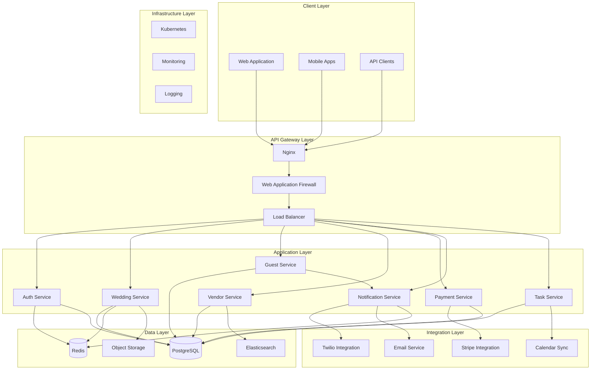

## Component Architecture

### 1. Authentication Service

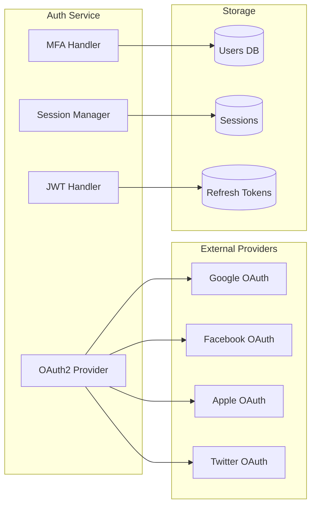

**Responsibilities:**
- User authentication and authorization
- JWT token generation and validation
- OAuth2 integration with social providers
- Session management
- Multi-factor authentication
- Password reset and recovery

**Key Technologies:**
- Passport.js for authentication strategies
- JWT for stateless authentication
- Redis for session storage
- Bcrypt for password hashing

### 2. Wedding Service

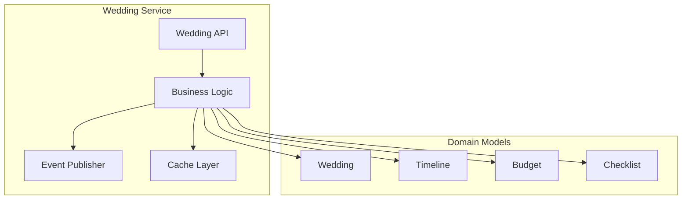

**Responsibilities:**
- Wedding CRUD operations
- Timeline management
- Budget tracking
- Checklist management
- Wedding templates
- Multi-language support

### 3. Guest Management Service

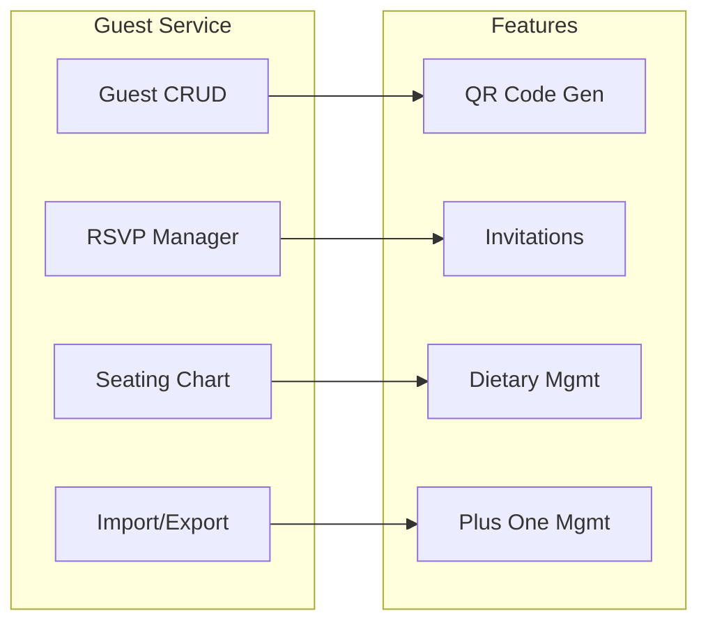

**Responsibilities:**
- Guest list management
- RSVP tracking and reminders
- Seating chart optimization
- Dietary restrictions tracking
- Guest communication
- QR code generation for check-in

### 4. Vendor Coordination Service

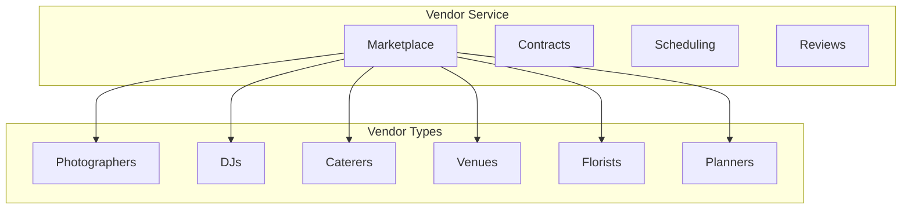

**Responsibilities:**
- Vendor marketplace
- Contract management
- Scheduling and availability
- Review and rating system
- Communication platform
- Payment tracking

### 5. Payment Service

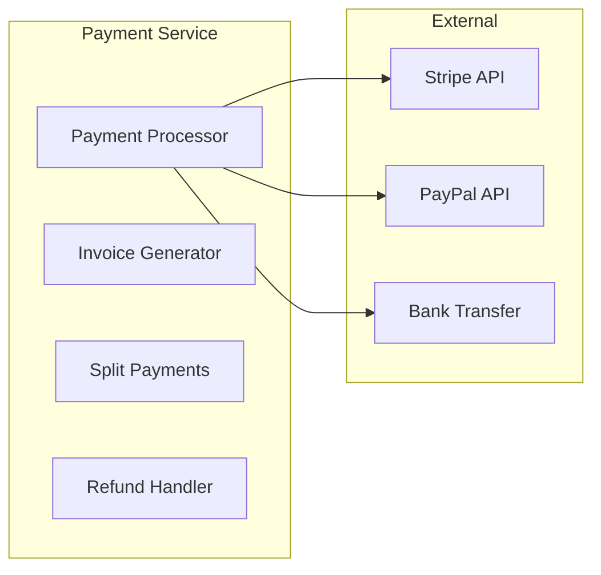

**Responsibilities:**
- Payment processing
- Invoice generation
- Split payment handling
- Refund management
- Payment schedules
- Financial reporting

### 6. Notification Service

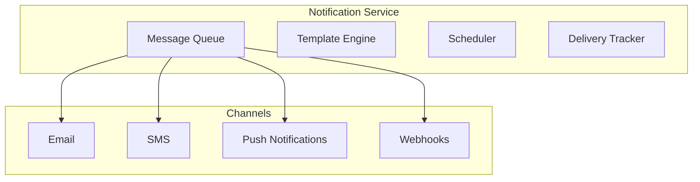

**Responsibilities:**
- Multi-channel notifications
- Template management
- Scheduled notifications
- Delivery tracking
- User preferences
- Unsubscribe management

## Data Architecture

### Database Schema

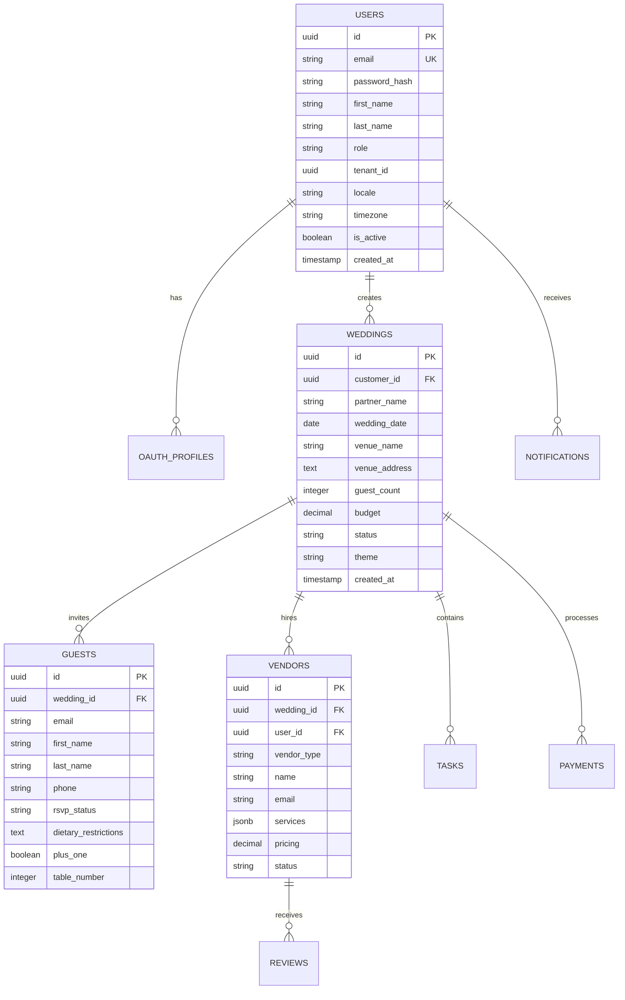

### Data Partitioning Strategy

- **Horizontal Partitioning**: By tenant_id for multi-tenancy
- **Time-based Partitioning**: Historical data by year
- **Geographic Partitioning**: By region for compliance

### Caching Strategy

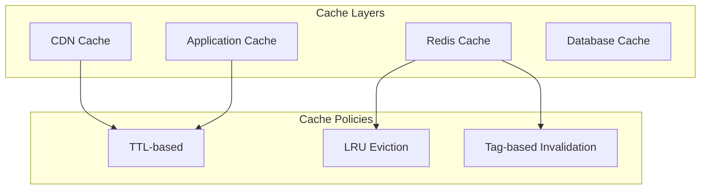

**Cache Implementation:**
- **CDN**: Static assets, images
- **Redis**: Session data, hot data
- **Application**: Computed values, API responses
- **Database**: Query result cache

## Security Architecture

### Security Layers

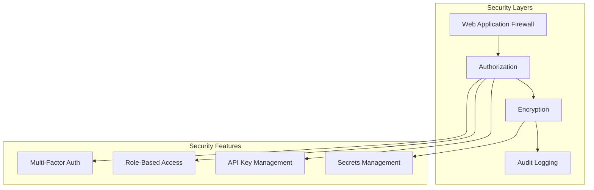

### Security Implementation

1. **Authentication**
   - JWT with short expiration (15 min)
   - Refresh tokens (7 days)
   - MFA for sensitive operations

2. **Authorization**
   - Role-based access control (RBAC)
   - Attribute-based access control (ABAC)
   - Resource-level permissions

3. **Encryption**
   - TLS 1.3 for all connections
   - AES-256 for data at rest
   - Field-level encryption for PII

4. **Compliance**
   - GDPR compliant
   - PCI DSS for payments
   - SOC 2 Type II

## Infrastructure Architecture

### Kubernetes Architecture

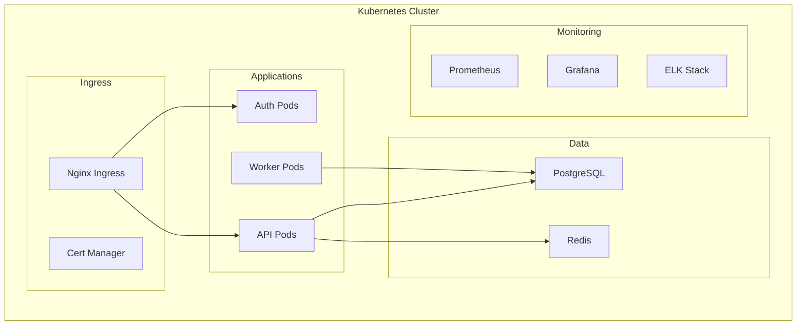

### Deployment Strategy

1. **Blue-Green Deployment**
   - Zero-downtime deployments
   - Easy rollback capability
   - A/B testing support

2. **Auto-scaling**
   - Horizontal Pod Autoscaler (HPA)
   - Vertical Pod Autoscaler (VPA)
   - Cluster autoscaling

3. **Service Mesh**
   - Istio for service communication
   - Traffic management
   - Security policies

### Monitoring and Observability

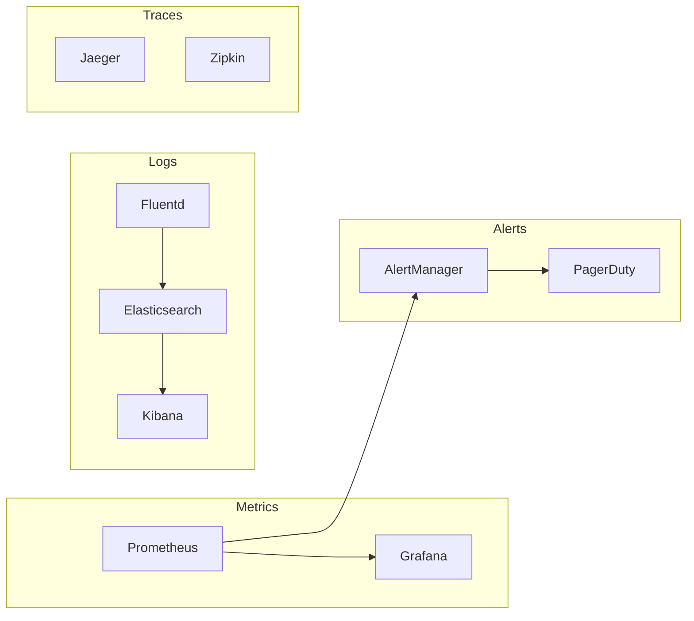

## Integration Architecture

### External Service Integration

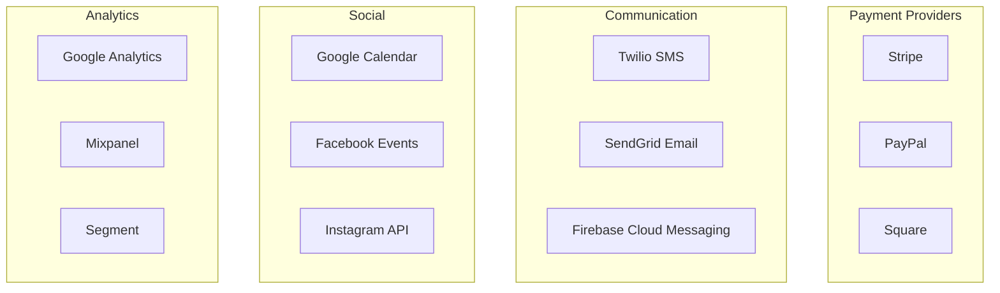

### Integration Patterns

1. **API Gateway Pattern**
   - Single entry point
   - Rate limiting
   - Authentication
   - Request routing

2. **Circuit Breaker Pattern**
   - Prevent cascade failures
   - Graceful degradation
   - Automatic recovery

3. **Retry Pattern**
   - Exponential backoff
   - Maximum retry limits
   - Dead letter queues

4. **Event-Driven Integration**
   - Webhook receivers
   - Event publishing
   - Async processing

## Performance Architecture

### Performance Optimization

1. **Database Optimization**
   - Connection pooling
   - Query optimization
   - Indexing strategy
   - Read replicas

2. **Caching Strategy**
   - Multi-level caching
   - Cache warming
   - Smart invalidation

3. **CDN Strategy**
   - Geographic distribution
   - Asset optimization
   - Edge computing

4. **Code Optimization**
   - Lazy loading
   - Code splitting
   - Tree shaking
   - Minification

### Performance Targets

- **API Response Time**: < 200ms (p95)
- **Page Load Time**: < 3s
- **Availability**: 99.9% uptime
- **Concurrent Users**: 10,000+
- **RPS**: 1,000 requests/second

## Disaster Recovery

### Backup Strategy

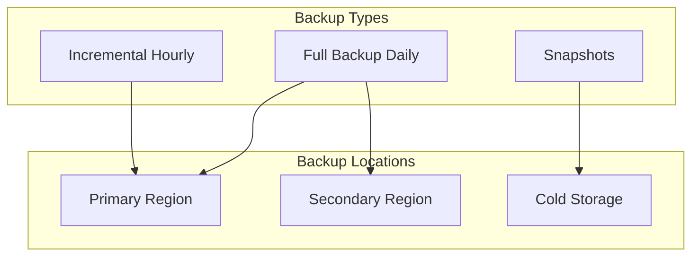

### Recovery Procedures

1. **RTO (Recovery Time Objective)**: < 4 hours
2. **RPO (Recovery Point Objective)**: < 1 hour
3. **Automated failover for critical services**
4. **Regular disaster recovery drills**

## Future Architecture Considerations

### Planned Enhancements

1. **GraphQL API**
   - More efficient data fetching
   - Real-time subscriptions
   - Better mobile performance

2. **Machine Learning Integration**
   - Vendor recommendations
   - Budget optimization
   - Guest seating optimization

3. **Blockchain Integration**
   - Smart contracts for vendors
   - Immutable event records
   - Decentralized reviews

4. **Edge Computing**
   - Reduced latency
   - Offline capabilities
   - Regional compliance

### Scalability Roadmap

1. **Phase 1**: Current (10K users)
   - Single region deployment
   - Basic auto-scaling

2. **Phase 2**: Growth (100K users)
   - Multi-region deployment
   - Advanced caching
   - Service mesh

3. **Phase 3**: Scale (1M+ users)
   - Global edge network
   - Multi-cloud strategy
   - AI/ML integration

## Architecture Decision Records (ADRs)

### ADR-001: Microservices Architecture
- **Status**: Accepted
- **Context**: Need for scalable, maintainable system
- **Decision**: Adopt microservices architecture
- **Consequences**: Higher complexity, better scalability

### ADR-002: PostgreSQL as Primary Database
- **Status**: Accepted
- **Context**: Need for ACID compliance and JSON support
- **Decision**: Use PostgreSQL with JSONB
- **Consequences**: Strong consistency, good performance

### ADR-003: Kubernetes for Orchestration
- **Status**: Accepted
- **Context**: Need for container orchestration
- **Decision**: Use Kubernetes with Helm
- **Consequences**: Industry standard, steep learning curve

### ADR-004: Event-Driven Architecture
- **Status**: Accepted
- **Context**: Need for real-time updates
- **Decision**: Implement event-driven patterns
- **Consequences**: Better UX, increased complexity