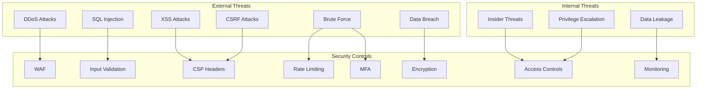
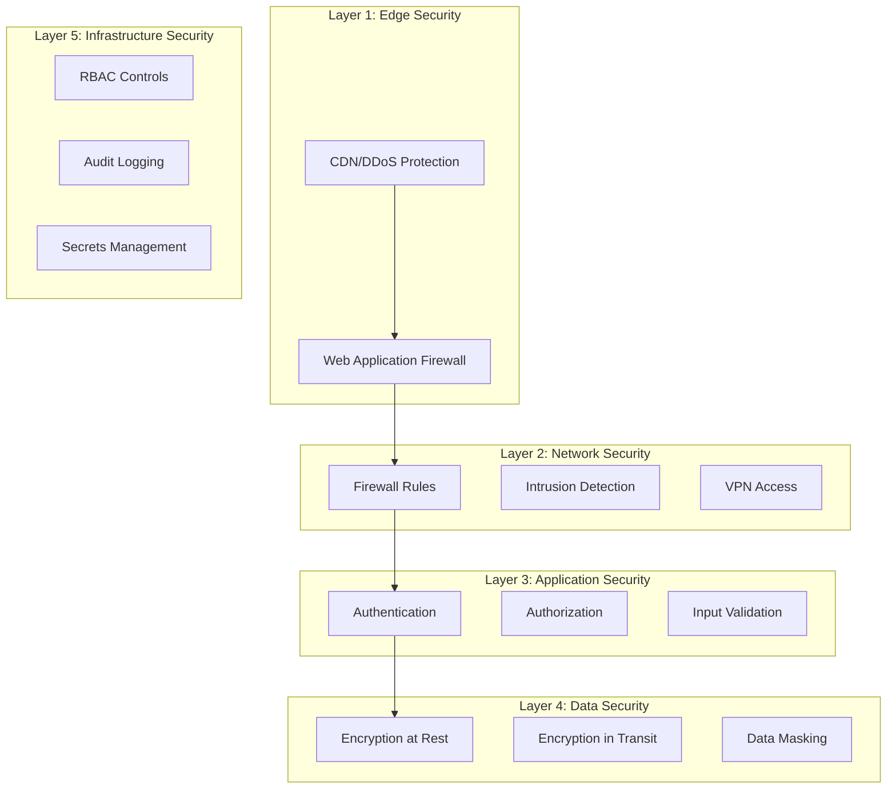
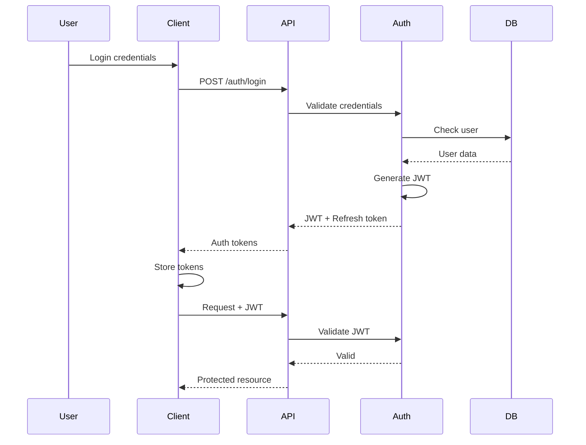

# Security Documentation - Attitudes.vip

## Table of Contents

1. [Security Overview](#security-overview)
2. [Security Architecture](#security-architecture)
3. [Authentication & Authorization](#authentication--authorization)
4. [Data Protection](#data-protection)
5. [Network Security](#network-security)
6. [Application Security](#application-security)
7. [Infrastructure Security](#infrastructure-security)
8. [Security Operations](#security-operations)
9. [Incident Response](#incident-response)
10. [Compliance & Standards](#compliance--standards)

## Security Overview

Attitudes.vip implements a comprehensive security framework based on zero-trust principles, defense-in-depth strategy, and industry best practices to protect user data and ensure platform integrity.

### Security Principles

1. **Zero Trust Architecture**: Never trust, always verify
2. **Least Privilege**: Minimal access rights for users and services
3. **Defense in Depth**: Multiple layers of security controls
4. **Data Minimization**: Collect and retain only necessary data
5. **Security by Design**: Security considered at every stage

### Threat Model



## Security Architecture

### Layered Security Model



### Security Components

1. **Cloudflare**: DDoS protection, WAF, CDN
2. **Nginx**: Reverse proxy, rate limiting
3. **OAuth2/JWT**: Authentication framework
4. **Vault**: Secrets management
5. **Falco**: Runtime security
6. **SIEM**: Security monitoring

## Authentication & Authorization

### Authentication Flow



### JWT Implementation

```javascript
// JWT Configuration
const jwtConfig = {
  accessToken: {
    secret: process.env.JWT_SECRET, // Min 256-bit secret
    expiresIn: '15m',
    algorithm: 'HS256'
  },
  refreshToken: {
    secret: process.env.REFRESH_SECRET,
    expiresIn: '7d',
    algorithm: 'HS256'
  }
};

// Token Generation
function generateTokens(user) {
  const payload = {
    userId: user.id,
    email: user.email,
    role: user.role,
    tenantId: user.tenantId
  };

  const accessToken = jwt.sign(
    payload,
    jwtConfig.accessToken.secret,
    {
      expiresIn: jwtConfig.accessToken.expiresIn,
      algorithm: jwtConfig.accessToken.algorithm,
      issuer: 'attitudes.vip',
      audience: 'attitudes-api'
    }
  );

  const refreshToken = jwt.sign(
    { userId: user.id },
    jwtConfig.refreshToken.secret,
    {
      expiresIn: jwtConfig.refreshToken.expiresIn,
      algorithm: jwtConfig.refreshToken.algorithm
    }
  );

  return { accessToken, refreshToken };
}

// Token Validation Middleware
const authenticate = async (req, res, next) => {
  try {
    const token = req.headers.authorization?.split(' ')[1];
    
    if (!token) {
      throw new AuthenticationError('No token provided');
    }

    const decoded = jwt.verify(token, jwtConfig.accessToken.secret, {
      algorithms: [jwtConfig.accessToken.algorithm],
      issuer: 'attitudes.vip',
      audience: 'attitudes-api'
    });

    // Check if token is blacklisted
    const isBlacklisted = await redis.exists(`blacklist:${token}`);
    if (isBlacklisted) {
      throw new AuthenticationError('Token revoked');
    }

    req.user = decoded;
    next();
  } catch (error) {
    next(new AuthenticationError('Invalid token'));
  }
};
```

### Multi-Factor Authentication (MFA)

```javascript
// TOTP Implementation
const speakeasy = require('speakeasy');
const QRCode = require('qrcode');

// Enable MFA
async function enableMFA(userId) {
  const secret = speakeasy.generateSecret({
    name: `Attitudes.vip (${user.email})`,
    issuer: 'Attitudes.vip',
    length: 32
  });

  // Store secret encrypted
  await User.update(
    { 
      mfaSecret: encrypt(secret.base32),
      mfaEnabled: false // Not enabled until verified
    },
    { where: { id: userId } }
  );

  // Generate QR code
  const qrCodeUrl = await QRCode.toDataURL(secret.otpauth_url);
  
  return {
    secret: secret.base32,
    qrCode: qrCodeUrl
  };
}

// Verify MFA Token
async function verifyMFAToken(userId, token) {
  const user = await User.findById(userId);
  const secret = decrypt(user.mfaSecret);

  const verified = speakeasy.totp.verify({
    secret,
    encoding: 'base32',
    token,
    window: 1 // Allow 30 second window
  });

  if (!verified) {
    throw new AuthenticationError('Invalid MFA token');
  }

  // Mark MFA as enabled on first successful verification
  if (!user.mfaEnabled) {
    await User.update(
      { mfaEnabled: true },
      { where: { id: userId } }
    );
  }

  return true;
}
```

### OAuth2 Integration

```javascript
// OAuth2 Strategy Configuration
const GoogleStrategy = require('passport-google-oauth20').Strategy;

passport.use(new GoogleStrategy({
  clientID: process.env.GOOGLE_CLIENT_ID,
  clientSecret: process.env.GOOGLE_CLIENT_SECRET,
  callbackURL: "/api/v1/auth/google/callback",
  scope: ['profile', 'email']
}, async (accessToken, refreshToken, profile, done) => {
  try {
    // Check if user exists
    let user = await User.findOne({
      where: { googleId: profile.id }
    });

    if (!user) {
      // Create new user
      user = await User.create({
        googleId: profile.id,
        email: profile.emails[0].value,
        firstName: profile.name.givenName,
        lastName: profile.name.familyName,
        emailVerified: true,
        profilePicture: profile.photos[0].value
      });
    }

    // Store OAuth tokens encrypted
    await OAuthToken.upsert({
      userId: user.id,
      provider: 'google',
      accessToken: encrypt(accessToken),
      refreshToken: encrypt(refreshToken),
      expiresAt: new Date(Date.now() + 3600000) // 1 hour
    });

    return done(null, user);
  } catch (error) {
    return done(error, null);
  }
}));
```

### Role-Based Access Control (RBAC)

```javascript
// Permission Matrix
const permissions = {
  cio: ['*'], // All permissions
  admin: [
    'user.*',
    'wedding.read',
    'wedding.update',
    'vendor.read',
    'analytics.*'
  ],
  client: [
    'wedding.create',
    'wedding.read',
    'wedding.update',
    'wedding.delete',
    'vendor.*',
    'analytics.own'
  ],
  customer: [
    'wedding.own.*',
    'guest.own.*',
    'vendor.own.read',
    'payment.own.*'
  ],
  vendor: [
    'vendor.own.*',
    'wedding.assigned.read',
    'payment.own.read'
  ],
  guest: [
    'guest.own.read',
    'guest.own.update',
    'wedding.invited.read'
  ]
};

// Authorization Middleware
const authorize = (requiredPermission) => {
  return (req, res, next) => {
    const userRole = req.user.role;
    const userPermissions = permissions[userRole] || [];

    // Check for wildcard permission
    if (userPermissions.includes('*')) {
      return next();
    }

    // Check specific permission
    const hasPermission = userPermissions.some(permission => {
      // Handle wildcard in permission
      if (permission.includes('*')) {
        const permissionBase = permission.replace('.*', '');
        return requiredPermission.startsWith(permissionBase);
      }
      return permission === requiredPermission;
    });

    if (!hasPermission) {
      return next(new ForbiddenError('Insufficient permissions'));
    }

    next();
  };
};

// Resource-level authorization
const authorizeResource = async (req, res, next) => {
  const { weddingId } = req.params;
  const userId = req.user.id;

  // Check if user owns or has access to the wedding
  const hasAccess = await Wedding.findOne({
    where: {
      id: weddingId,
      [Op.or]: [
        { customerId: userId },
        { '$vendors.userId$': userId },
        { '$guests.userId$': userId }
      ]
    },
    include: [
      { model: Vendor, attributes: ['userId'] },
      { model: Guest, attributes: ['userId'] }
    ]
  });

  if (!hasAccess) {
    return next(new ForbiddenError('Access denied to this resource'));
  }

  next();
};
```

## Data Protection

### Encryption

#### Encryption at Rest

```javascript
// Field-level encryption for sensitive data
const crypto = require('crypto');

class EncryptionService {
  constructor() {
    this.algorithm = 'aes-256-gcm';
    this.keyDerivationSalt = Buffer.from(process.env.ENCRYPTION_SALT, 'hex');
  }

  deriveKey(password) {
    return crypto.pbkdf2Sync(
      password,
      this.keyDerivationSalt,
      100000,
      32,
      'sha256'
    );
  }

  encrypt(text, password = process.env.ENCRYPTION_KEY) {
    const key = this.deriveKey(password);
    const iv = crypto.randomBytes(16);
    const cipher = crypto.createCipheriv(this.algorithm, key, iv);
    
    let encrypted = cipher.update(text, 'utf8', 'hex');
    encrypted += cipher.final('hex');
    
    const authTag = cipher.getAuthTag();
    
    return iv.toString('hex') + ':' + authTag.toString('hex') + ':' + encrypted;
  }

  decrypt(encryptedText, password = process.env.ENCRYPTION_KEY) {
    const parts = encryptedText.split(':');
    const iv = Buffer.from(parts[0], 'hex');
    const authTag = Buffer.from(parts[1], 'hex');
    const encrypted = parts[2];
    
    const key = this.deriveKey(password);
    const decipher = crypto.createDecipheriv(this.algorithm, key, iv);
    decipher.setAuthTag(authTag);
    
    let decrypted = decipher.update(encrypted, 'hex', 'utf8');
    decrypted += decipher.final('utf8');
    
    return decrypted;
  }
}

// Database model with encrypted fields
const User = sequelize.define('User', {
  email: {
    type: DataTypes.STRING,
    unique: true,
    set(value) {
      // Store email hash for indexing
      this.setDataValue('emailHash', hash(value.toLowerCase()));
      // Store encrypted email
      this.setDataValue('email', encryptionService.encrypt(value));
    },
    get() {
      const encrypted = this.getDataValue('email');
      return encrypted ? encryptionService.decrypt(encrypted) : null;
    }
  },
  phone: {
    type: DataTypes.STRING,
    set(value) {
      if (value) {
        this.setDataValue('phone', encryptionService.encrypt(value));
      }
    },
    get() {
      const encrypted = this.getDataValue('phone');
      return encrypted ? encryptionService.decrypt(encrypted) : null;
    }
  }
});
```

#### Encryption in Transit

```nginx
# Nginx SSL Configuration
server {
    listen 443 ssl http2;
    server_name api.attitudes.vip;

    # SSL certificates
    ssl_certificate /etc/nginx/ssl/attitudes.crt;
    ssl_certificate_key /etc/nginx/ssl/attitudes.key;

    # Modern SSL configuration
    ssl_protocols TLSv1.2 TLSv1.3;
    ssl_ciphers ECDHE-ECDSA-AES128-GCM-SHA256:ECDHE-RSA-AES128-GCM-SHA256:ECDHE-ECDSA-AES256-GCM-SHA384:ECDHE-RSA-AES256-GCM-SHA384;
    ssl_prefer_server_ciphers off;

    # OCSP stapling
    ssl_stapling on;
    ssl_stapling_verify on;
    ssl_trusted_certificate /etc/nginx/ssl/attitudes-ca.crt;

    # Security headers
    add_header Strict-Transport-Security "max-age=31536000; includeSubDomains; preload" always;
    add_header X-Frame-Options "SAMEORIGIN" always;
    add_header X-Content-Type-Options "nosniff" always;
    add_header X-XSS-Protection "1; mode=block" always;
    add_header Referrer-Policy "strict-origin-when-cross-origin" always;
    
    # Certificate pinning
    add_header Public-Key-Pins 'pin-sha256="base64+primary=="; pin-sha256="base64+backup=="; max-age=5184000; includeSubDomains';
}
```

### Data Masking and Anonymization

```javascript
// PII Masking for logs and non-production environments
class DataMasker {
  maskEmail(email) {
    const [local, domain] = email.split('@');
    const maskedLocal = local.charAt(0) + '*'.repeat(local.length - 2) + local.charAt(local.length - 1);
    return `${maskedLocal}@${domain}`;
  }

  maskPhone(phone) {
    // Keep country code and last 2 digits
    return phone.replace(/(\d{2})(\d+)(\d{2})/, '$1****$3');
  }

  maskName(name) {
    return name.charAt(0) + '*'.repeat(name.length - 1);
  }

  maskCreditCard(number) {
    // Show only last 4 digits
    return '*'.repeat(number.length - 4) + number.slice(-4);
  }

  // Anonymize data for analytics
  anonymizeUser(user) {
    return {
      id: hash(user.id), // One-way hash
      age: Math.floor(user.age / 5) * 5, // Age bucket
      region: user.country, // Remove specific location
      weddingMonth: user.weddingDate.getMonth(),
      guestCountBucket: Math.floor(user.guestCount / 50) * 50
    };
  }
}

// Logging middleware with PII masking
const loggingMiddleware = (req, res, next) => {
  const masker = new DataMasker();
  
  // Mask sensitive data in request
  const sanitizedBody = { ...req.body };
  if (sanitizedBody.email) {
    sanitizedBody.email = masker.maskEmail(sanitizedBody.email);
  }
  if (sanitizedBody.phone) {
    sanitizedBody.phone = masker.maskPhone(sanitizedBody.phone);
  }
  
  logger.info('API Request', {
    method: req.method,
    path: req.path,
    body: sanitizedBody,
    ip: req.ip,
    userAgent: req.get('user-agent')
  });
  
  next();
};
```

### Data Retention and Deletion

```javascript
// GDPR-compliant data retention
class DataRetentionService {
  async enforceRetentionPolicies() {
    // Delete unverified accounts after 30 days
    await User.destroy({
      where: {
        emailVerified: false,
        createdAt: {
          [Op.lt]: new Date(Date.now() - 30 * 24 * 60 * 60 * 1000)
        }
      }
    });

    // Archive completed weddings after 2 years
    const oldWeddings = await Wedding.findAll({
      where: {
        status: 'completed',
        weddingDate: {
          [Op.lt]: new Date(Date.now() - 2 * 365 * 24 * 60 * 60 * 1000)
        }
      }
    });

    for (const wedding of oldWeddings) {
      await this.archiveWedding(wedding);
    }

    // Delete logs older than 90 days
    await Log.destroy({
      where: {
        createdAt: {
          [Op.lt]: new Date(Date.now() - 90 * 24 * 60 * 60 * 1000)
        }
      }
    });
  }

  async handleUserDeletion(userId) {
    const user = await User.findById(userId);
    
    // Anonymize instead of hard delete
    await user.update({
      email: `deleted_${userId}@attitudes.vip`,
      firstName: 'Deleted',
      lastName: 'User',
      phone: null,
      isDeleted: true,
      deletedAt: new Date()
    });

    // Remove PII from related records
    await Wedding.update(
      { customerName: 'Deleted User' },
      { where: { customerId: userId } }
    );

    // Delete authentication data
    await OAuthProfile.destroy({ where: { userId } });
    await Session.destroy({ where: { userId } });
    
    // Schedule permanent deletion after legal retention period
    await DeletionQueue.create({
      userId,
      scheduledFor: new Date(Date.now() + 7 * 365 * 24 * 60 * 60 * 1000) // 7 years
    });
  }
}
```

## Network Security

### Firewall Rules

```yaml
# Kubernetes Network Policies
apiVersion: networking.k8s.io/v1
kind: NetworkPolicy
metadata:
  name: api-network-policy
spec:
  podSelector:
    matchLabels:
      app: api-service
  policyTypes:
  - Ingress
  - Egress
  ingress:
  - from:
    - namespaceSelector:
        matchLabels:
          name: ingress-nginx
    - podSelector:
        matchLabels:
          app: nginx
    ports:
    - protocol: TCP
      port: 3000
  egress:
  - to:
    - podSelector:
        matchLabels:
          app: postgres
    ports:
    - protocol: TCP
      port: 5432
  - to:
    - podSelector:
        matchLabels:
          app: redis
    ports:
    - protocol: TCP
      port: 6379
  # Allow DNS
  - to:
    - namespaceSelector: {}
      podSelector:
        matchLabels:
          k8s-app: kube-dns
    ports:
    - protocol: UDP
      port: 53
```

### DDoS Protection

```javascript
// Rate limiting configuration
const rateLimit = require('express-rate-limit');
const RedisStore = require('rate-limit-redis');

// Different limits for different endpoints
const createAccountLimiter = rateLimit({
  store: new RedisStore({
    client: redis,
    prefix: 'rl:createAccount:'
  }),
  windowMs: 15 * 60 * 1000, // 15 minutes
  max: 5, // 5 requests per window
  message: 'Too many accounts created from this IP',
  standardHeaders: true,
  legacyHeaders: false,
});

const apiLimiter = rateLimit({
  store: new RedisStore({
    client: redis,
    prefix: 'rl:api:'
  }),
  windowMs: 15 * 60 * 1000,
  max: 100,
  message: 'Too many requests from this IP',
  skip: (req) => {
    // Skip rate limiting for authenticated premium users
    return req.user?.isPremium;
  }
});

// Progressive rate limiting based on behavior
const progressiveRateLimit = async (req, res, next) => {
  const ip = req.ip;
  const key = `suspicious:${ip}`;
  
  // Check if IP is flagged as suspicious
  const suspiciousScore = await redis.get(key) || 0;
  
  if (suspiciousScore > 10) {
    // Heavily limit suspicious IPs
    const limited = await redis.incr(`heavyLimit:${ip}`);
    await redis.expire(`heavyLimit:${ip}`, 3600); // 1 hour
    
    if (limited > 10) {
      return res.status(429).json({
        error: 'Rate limit exceeded. Please try again later.'
      });
    }
  }
  
  next();
};

// Cloudflare configuration for DDoS protection
const cloudflareConfig = {
  securityLevel: 'high',
  challengePassage: 30,
  browserIntegrityCheck: true,
  hotlinkProtection: true,
  rateLimit: {
    threshold: 50,
    period: 60,
    action: 'challenge'
  },
  waf: {
    rules: [
      'OWASP ModSecurity Core Rule Set',
      'Cloudflare Managed Ruleset'
    ]
  }
};
```

### VPN and Secure Access

```yaml
# WireGuard VPN Configuration for Admin Access
[Interface]
PrivateKey = <server-private-key>
Address = 10.0.0.1/24
ListenPort = 51820

[Peer]
# Admin user
PublicKey = <admin-public-key>
AllowedIPs = 10.0.0.2/32

# OpenVPN configuration for broader access
port 1194
proto udp
dev tun
ca ca.crt
cert server.crt
key server.key
dh dh2048.pem
server 10.8.0.0 255.255.255.0
push "route 10.0.0.0 255.255.255.0"
keepalive 10 120
tls-auth ta.key 0
cipher AES-256-CBC
auth SHA256
comp-lzo
persist-key
persist-tun
status openvpn-status.log
verb 3
```

## Application Security

### Input Validation and Sanitization

```javascript
const validator = require('validator');
const DOMPurify = require('isomorphic-dompurify');

// Input validation middleware
const validateInput = (schema) => {
  return (req, res, next) => {
    const { error, value } = schema.validate(req.body, {
      abortEarly: false,
      stripUnknown: true
    });

    if (error) {
      const errors = error.details.map(detail => ({
        field: detail.path.join('.'),
        message: detail.message
      }));
      
      return res.status(400).json({
        success: false,
        error: {
          code: 'VALIDATION_ERROR',
          message: 'Invalid input',
          errors
        }
      });
    }

    // Sanitize HTML content
    if (value.description) {
      value.description = DOMPurify.sanitize(value.description, {
        ALLOWED_TAGS: ['p', 'br', 'strong', 'em', 'u'],
        ALLOWED_ATTR: []
      });
    }

    req.body = value;
    next();
  };
};

// Joi schemas for validation
const weddingSchema = Joi.object({
  date: Joi.date().iso().min('now').required(),
  venue: Joi.string().trim().min(2).max(100).required(),
  guestCount: Joi.number().integer().min(1).max(1000).required(),
  budget: Joi.number().positive().max(1000000),
  description: Joi.string().max(5000),
  theme: Joi.string().valid('classic', 'modern', 'rustic', 'beach', 'garden')
});

// SQL injection prevention
const safeQuery = (query, params) => {
  // Use parameterized queries
  return db.query(query, params);
};

// NoSQL injection prevention
const sanitizeMongoQuery = (query) => {
  // Remove any $ operators from user input
  const sanitized = {};
  for (const key in query) {
    if (typeof query[key] === 'string' && !key.startsWith('$')) {
      sanitized[key] = query[key].replace(/[$]/g, '');
    } else if (typeof query[key] === 'object') {
      sanitized[key] = sanitizeMongoQuery(query[key]);
    } else {
      sanitized[key] = query[key];
    }
  }
  return sanitized;
};
```

### XSS Prevention

```javascript
// Content Security Policy
app.use(helmet.contentSecurityPolicy({
  directives: {
    defaultSrc: ["'self'"],
    scriptSrc: [
      "'self'",
      "'sha256-hash-of-inline-script'",
      "https://cdn.jsdelivr.net"
    ],
    styleSrc: [
      "'self'",
      "'unsafe-inline'", // Required for some libraries
      "https://fonts.googleapis.com"
    ],
    imgSrc: [
      "'self'",
      "data:",
      "https:",
      "https://*.cloudinary.com"
    ],
    connectSrc: [
      "'self'",
      "wss://api.attitudes.vip",
      "https://api.stripe.com"
    ],
    fontSrc: [
      "'self'",
      "https://fonts.gstatic.com"
    ],
    objectSrc: ["'none'"],
    mediaSrc: ["'self'"],
    frameSrc: ["https://js.stripe.com"],
    sandbox: ['allow-forms', 'allow-scripts', 'allow-same-origin'],
    reportUri: '/api/v1/csp-report',
    upgradeInsecureRequests: true
  },
  reportOnly: false
}));

// XSS protection headers
app.use((req, res, next) => {
  res.setHeader('X-XSS-Protection', '1; mode=block');
  res.setHeader('X-Content-Type-Options', 'nosniff');
  res.setHeader('X-Frame-Options', 'SAMEORIGIN');
  res.setHeader('Referrer-Policy', 'strict-origin-when-cross-origin');
  res.setHeader('Permissions-Policy', 'geolocation=(), microphone=(), camera=()');
  next();
});

// React component with XSS protection
const SafeHtmlComponent = ({ content }) => {
  const sanitizedContent = DOMPurify.sanitize(content, {
    ALLOWED_TAGS: ['p', 'br', 'strong', 'em', 'ul', 'li'],
    ALLOWED_ATTR: ['class']
  });

  return (
    <div 
      dangerouslySetInnerHTML={{ __html: sanitizedContent }}
      className="user-content"
    />
  );
};
```

### CSRF Protection

```javascript
const csrf = require('csurf');

// CSRF middleware
const csrfProtection = csrf({
  cookie: {
    httpOnly: true,
    secure: process.env.NODE_ENV === 'production',
    sameSite: 'strict'
  }
});

// Apply to state-changing routes
app.use('/api/v1/weddings', csrfProtection);
app.use('/api/v1/payments', csrfProtection);

// Provide CSRF token to client
app.get('/api/v1/csrf-token', csrfProtection, (req, res) => {
  res.json({ csrfToken: req.csrfToken() });
});

// Double submit cookie pattern for SPAs
const doubleSubmitCookie = (req, res, next) => {
  const token = req.headers['x-csrf-token'];
  const cookie = req.cookies['csrf-token'];
  
  if (!token || token !== cookie) {
    return res.status(403).json({
      error: 'Invalid CSRF token'
    });
  }
  
  next();
};
```

### Security Headers

```javascript
// Comprehensive security headers
app.use((req, res, next) => {
  // HSTS - Force HTTPS
  res.setHeader(
    'Strict-Transport-Security',
    'max-age=31536000; includeSubDomains; preload'
  );
  
  // Prevent MIME type sniffing
  res.setHeader('X-Content-Type-Options', 'nosniff');
  
  // XSS Protection
  res.setHeader('X-XSS-Protection', '1; mode=block');
  
  // Clickjacking protection
  res.setHeader('X-Frame-Options', 'DENY');
  
  // Referrer Policy
  res.setHeader('Referrer-Policy', 'strict-origin-when-cross-origin');
  
  // Feature Policy / Permissions Policy
  res.setHeader(
    'Permissions-Policy',
    'accelerometer=(), camera=(), geolocation=(), gyroscope=(), magnetometer=(), microphone=(), payment=(), usb=()'
  );
  
  // DNS Prefetch Control
  res.setHeader('X-DNS-Prefetch-Control', 'off');
  
  // Download Options
  res.setHeader('X-Download-Options', 'noopen');
  
  // Content Type Options
  res.setHeader('X-Permitted-Cross-Domain-Policies', 'none');
  
  // Remove powered by header
  res.removeHeader('X-Powered-By');
  
  next();
});
```

## Infrastructure Security

### Container Security

```dockerfile
# Secure Docker image
FROM node:18-alpine AS builder

# Install security updates
RUN apk update && apk upgrade && apk add --no-cache \
    ca-certificates \
    && rm -rf /var/cache/apk/*

# Create non-root user
RUN addgroup -g 1001 -S nodejs && \
    adduser -S nodejs -u 1001

# Set working directory
WORKDIR /app

# Copy package files with specific permissions
COPY --chown=nodejs:nodejs package*.json ./

# Install production dependencies only
RUN npm ci --only=production && npm cache clean --force

# Copy application code
COPY --chown=nodejs:nodejs . .

# Remove unnecessary files
RUN rm -rf .git .env* *.md

# Switch to non-root user
USER nodejs

# Security scan
RUN npm audit --production

# Health check
HEALTHCHECK --interval=30s --timeout=3s --start-period=40s --retries=3 \
  CMD node healthcheck.js || exit 1

# Expose port (non-privileged)
EXPOSE 3000

# Run with minimal privileges
CMD ["node", "--max-old-space-size=256", "server.js"]
```

### Kubernetes Security

```yaml
# Pod Security Policy
apiVersion: policy/v1beta1
kind: PodSecurityPolicy
metadata:
  name: restricted
spec:
  privileged: false
  allowPrivilegeEscalation: false
  requiredDropCapabilities:
    - ALL
  volumes:
    - 'configMap'
    - 'emptyDir'
    - 'projected'
    - 'secret'
    - 'downwardAPI'
    - 'persistentVolumeClaim'
  hostNetwork: false
  hostIPC: false
  hostPID: false
  runAsUser:
    rule: 'MustRunAsNonRoot'
  runAsGroup:
    rule: 'MustRunAs'
    ranges:
      - min: 1
        max: 65535
  seLinux:
    rule: 'RunAsAny'
  supplementalGroups:
    rule: 'MustRunAs'
    ranges:
      - min: 1
        max: 65535
  fsGroup:
    rule: 'MustRunAs'
    ranges:
      - min: 1
        max: 65535
  readOnlyRootFilesystem: true
---
# Security Context for Deployments
apiVersion: apps/v1
kind: Deployment
metadata:
  name: api-service
spec:
  template:
    spec:
      securityContext:
        runAsNonRoot: true
        runAsUser: 1001
        fsGroup: 1001
      containers:
      - name: api
        image: attitudes/api:latest
        securityContext:
          allowPrivilegeEscalation: false
          readOnlyRootFilesystem: true
          capabilities:
            drop:
              - ALL
        volumeMounts:
        - name: tmp
          mountPath: /tmp
        - name: cache
          mountPath: /app/.cache
      volumes:
      - name: tmp
        emptyDir: {}
      - name: cache
        emptyDir: {}
```

### Secrets Management

```yaml
# External Secrets Operator
apiVersion: external-secrets.io/v1beta1
kind: SecretStore
metadata:
  name: vault-backend
spec:
  provider:
    vault:
      server: "https://vault.attitudes.vip"
      path: "secret"
      version: "v2"
      auth:
        kubernetes:
          mountPath: "kubernetes"
          role: "attitudes-app"
---
apiVersion: external-secrets.io/v1beta1
kind: ExternalSecret
metadata:
  name: app-secrets
spec:
  refreshInterval: 15m
  secretStoreRef:
    name: vault-backend
    kind: SecretStore
  target:
    name: app-secrets
    creationPolicy: Owner
  data:
  - secretKey: database-url
    remoteRef:
      key: attitudes/database
      property: url
  - secretKey: jwt-secret
    remoteRef:
      key: attitudes/auth
      property: jwt-secret
```

### Infrastructure as Code Security

```hcl
# Terraform security best practices
# versions.tf
terraform {
  required_version = ">= 1.0"
  required_providers {
    aws = {
      source  = "hashicorp/aws"
      version = "~> 4.0"
    }
  }
  
  # Remote state with encryption
  backend "s3" {
    bucket         = "attitudes-terraform-state"
    key            = "production/terraform.tfstate"
    region         = "us-east-1"
    encrypt        = true
    kms_key_id     = "arn:aws:kms:us-east-1:123456789:key/12345"
    dynamodb_table = "terraform-state-lock"
  }
}

# Security group with minimal permissions
resource "aws_security_group" "api" {
  name_prefix = "attitudes-api-"
  description = "Security group for API servers"
  vpc_id      = aws_vpc.main.id

  # Inbound rules - only HTTPS from ALB
  ingress {
    description     = "HTTPS from ALB"
    from_port       = 443
    to_port         = 443
    protocol        = "tcp"
    security_groups = [aws_security_group.alb.id]
  }

  # Outbound rules - explicit allowlist
  egress {
    description = "HTTPS to RDS"
    from_port   = 5432
    to_port     = 5432
    protocol    = "tcp"
    cidr_blocks = [aws_subnet.database.cidr_block]
  }

  egress {
    description = "HTTPS for external APIs"
    from_port   = 443
    to_port     = 443
    protocol    = "tcp"
    cidr_blocks = ["0.0.0.0/0"]
  }

  lifecycle {
    create_before_destroy = true
  }
}
```

## Security Operations

### Logging and Monitoring

```javascript
// Security event logging
class SecurityLogger {
  constructor() {
    this.logger = winston.createLogger({
      level: 'info',
      format: winston.format.json(),
      defaultMeta: { service: 'security' },
      transports: [
        new winston.transports.File({ 
          filename: 'security.log',
          maxsize: 10485760, // 10MB
          maxFiles: 10
        }),
        new winston.transports.Console({
          format: winston.format.combine(
            winston.format.colorize(),
            winston.format.simple()
          )
        })
      ]
    });
  }

  logAuthFailure(req, reason) {
    this.logger.warn('Authentication failure', {
      event: 'AUTH_FAILURE',
      ip: req.ip,
      userAgent: req.get('user-agent'),
      reason,
      timestamp: new Date().toISOString()
    });
  }

  logSuspiciousActivity(req, activity) {
    this.logger.error('Suspicious activity detected', {
      event: 'SUSPICIOUS_ACTIVITY',
      ip: req.ip,
      userAgent: req.get('user-agent'),
      activity,
      path: req.path,
      method: req.method,
      timestamp: new Date().toISOString()
    });
  }

  logSecurityEvent(event, details) {
    this.logger.info('Security event', {
      event,
      ...details,
      timestamp: new Date().toISOString()
    });
  }
}

// Intrusion detection
const detectIntrusion = async (req, res, next) => {
  const ip = req.ip;
  const path = req.path;
  
  // Check for common attack patterns
  const suspiciousPatterns = [
    /\.\.\//,           // Path traversal
    /<script/i,         // XSS attempt
    /union.*select/i,   // SQL injection
    /eval\(/,           // Code injection
    /\${.*}/,           // Template injection
  ];
  
  const isSuspicious = suspiciousPatterns.some(pattern => 
    pattern.test(req.url) || 
    pattern.test(JSON.stringify(req.body)) ||
    pattern.test(JSON.stringify(req.query))
  );
  
  if (isSuspicious) {
    securityLogger.logSuspiciousActivity(req, 'Attack pattern detected');
    
    // Increment suspicious score
    await redis.incr(`suspicious:${ip}`);
    await redis.expire(`suspicious:${ip}`, 86400); // 24 hours
    
    // Block if score too high
    const score = await redis.get(`suspicious:${ip}`);
    if (score > 5) {
      return res.status(403).json({
        error: 'Access denied due to suspicious activity'
      });
    }
  }
  
  next();
};
```

### Security Monitoring Dashboard

```javascript
// Prometheus metrics for security monitoring
const promClient = require('prom-client');

// Security metrics
const authFailures = new promClient.Counter({
  name: 'auth_failures_total',
  help: 'Total number of authentication failures',
  labelNames: ['reason', 'ip_range']
});

const suspiciousRequests = new promClient.Counter({
  name: 'suspicious_requests_total',
  help: 'Total number of suspicious requests',
  labelNames: ['type', 'ip_range']
});

const blockedIPs = new promClient.Gauge({
  name: 'blocked_ips_current',
  help: 'Current number of blocked IPs'
});

// Grafana alerts
const alertRules = {
  highAuthFailureRate: {
    expr: 'rate(auth_failures_total[5m]) > 10',
    for: '5m',
    labels: {
      severity: 'warning'
    },
    annotations: {
      summary: 'High authentication failure rate',
      description: 'Auth failures exceeding 10 per minute'
    }
  },
  suspiciousActivitySpike: {
    expr: 'rate(suspicious_requests_total[5m]) > 50',
    for: '2m',
    labels: {
      severity: 'critical'
    },
    annotations: {
      summary: 'Suspicious activity spike detected',
      description: 'Possible ongoing attack'
    }
  }
};
```

### Vulnerability Scanning

```yaml
# Trivy scanning in CI/CD
name: Security Scan
on:
  push:
    branches: [main, develop]
  pull_request:

jobs:
  security:
    runs-on: ubuntu-latest
    steps:
    - uses: actions/checkout@v3
    
    - name: Run Trivy vulnerability scanner
      uses: aquasecurity/trivy-action@master
      with:
        image-ref: 'attitudes/api:${{ github.sha }}'
        format: 'sarif'
        output: 'trivy-results.sarif'
        severity: 'CRITICAL,HIGH'
    
    - name: Upload Trivy scan results
      uses: github/codeql-action/upload-sarif@v2
      with:
        sarif_file: 'trivy-results.sarif'
    
    - name: Run npm audit
      run: |
        npm audit --production --audit-level=moderate
    
    - name: Run OWASP dependency check
      uses: jeremylong/DependencyCheck-Action@main
      with:
        project: 'Attitudes.vip'
        path: '.'
        format: 'HTML'
```

## Incident Response

### Incident Response Plan

```markdown
# Incident Response Playbook

## 1. Detection and Analysis
- Monitor alerts from SIEM, IDS, and monitoring tools
- Verify the incident is real (not false positive)
- Determine scope and impact
- Classify severity (Critical/High/Medium/Low)

## 2. Containment
- Isolate affected systems
- Block malicious IPs/domains
- Disable compromised accounts
- Preserve evidence for forensics

## 3. Eradication
- Remove malware/backdoors
- Patch vulnerabilities
- Reset compromised credentials
- Update security rules

## 4. Recovery
- Restore from clean backups
- Rebuild affected systems
- Monitor for re-infection
- Verify system integrity

## 5. Post-Incident
- Document lessons learned
- Update security controls
- Conduct tabletop exercise
- Report to stakeholders
```

### Automated Incident Response

```javascript
// Automated response to security incidents
class IncidentResponseService {
  async handleSecurityIncident(incident) {
    const { type, severity, details } = incident;
    
    // Log incident
    await this.logIncident(incident);
    
    // Notify security team
    await this.notifySecurityTeam(incident);
    
    // Automated responses based on type
    switch (type) {
      case 'BRUTE_FORCE':
        await this.handleBruteForce(details);
        break;
      case 'DATA_BREACH':
        await this.handleDataBreach(details);
        break;
      case 'DDoS':
        await this.handleDDoS(details);
        break;
      case 'MALWARE':
        await this.handleMalware(details);
        break;
    }
    
    // Create incident ticket
    await this.createIncidentTicket(incident);
  }
  
  async handleBruteForce(details) {
    const { ip, targetAccount } = details;
    
    // Block IP immediately
    await this.blockIP(ip, 'Brute force attack');
    
    // Lock affected account
    await User.update(
      { accountLocked: true },
      { where: { email: targetAccount } }
    );
    
    // Force password reset
    await this.sendPasswordResetNotification(targetAccount);
    
    // Add to permanent blocklist if severe
    if (details.attempts > 100) {
      await this.addToPermanentBlocklist(ip);
    }
  }
  
  async handleDataBreach(details) {
    // Activate incident response team
    await this.activateIRT();
    
    // Begin forensic data collection
    await this.startForensicCollection();
    
    // Notify affected users
    const affectedUsers = await this.identifyAffectedUsers(details);
    await this.notifyUsers(affectedUsers, 'DATA_BREACH');
    
    // Report to authorities if required
    if (this.requiresRegulatorNotification(details)) {
      await this.notifyRegulators(details);
    }
  }
}

// Forensic data collection
class ForensicCollector {
  async collectEvidence(incidentId) {
    const evidence = {
      timestamp: new Date().toISOString(),
      logs: await this.collectLogs(),
      networkTraffic: await this.captureNetworkTraffic(),
      memoryDump: await this.dumpMemory(),
      diskImage: await this.createDiskImage(),
      configurations: await this.saveConfigurations()
    };
    
    // Store evidence securely
    await this.storeEvidence(incidentId, evidence);
    
    // Create chain of custody
    await this.createChainOfCustody(incidentId);
  }
}
```

## Compliance & Standards

### GDPR Compliance

```javascript
// GDPR compliance features
class GDPRComplianceService {
  // Right to access
  async exportUserData(userId) {
    const user = await User.findById(userId);
    const data = {
      profile: user.toJSON(),
      weddings: await Wedding.findAll({ where: { customerId: userId } }),
      payments: await Payment.findAll({ where: { userId } }),
      logs: await AuditLog.findAll({ where: { userId } })
    };
    
    // Create encrypted archive
    const archive = await this.createEncryptedArchive(data);
    
    // Log data export
    await AuditLog.create({
      userId,
      action: 'DATA_EXPORT',
      timestamp: new Date()
    });
    
    return archive;
  }
  
  // Right to erasure
  async deleteUserData(userId, reason) {
    // Verify deletion request
    await this.verifyDeletionRequest(userId);
    
    // Anonymize data instead of hard delete
    await this.anonymizeUserData(userId);
    
    // Schedule permanent deletion
    await DeletionQueue.create({
      userId,
      reason,
      scheduledFor: new Date(Date.now() + RETENTION_PERIOD)
    });
    
    // Log deletion request
    await AuditLog.create({
      userId,
      action: 'DELETION_REQUESTED',
      reason,
      timestamp: new Date()
    });
  }
  
  // Cookie consent
  async updateConsent(userId, consents) {
    await UserConsent.upsert({
      userId,
      analytics: consents.analytics || false,
      marketing: consents.marketing || false,
      functional: consents.functional || true,
      updatedAt: new Date()
    });
  }
}
```

### PCI DSS Compliance

```javascript
// PCI DSS compliant payment handling
class PCICompliantPaymentService {
  // Never store sensitive card data
  async processPayment(paymentData) {
    // Validate PCI compliance
    this.validatePCICompliance();
    
    // Use tokenization
    const token = await stripe.tokens.create({
      card: {
        number: paymentData.cardNumber,
        exp_month: paymentData.expMonth,
        exp_year: paymentData.expYear,
        cvc: paymentData.cvc
      }
    });
    
    // Process payment with token
    const charge = await stripe.charges.create({
      amount: paymentData.amount,
      currency: 'eur',
      source: token.id,
      description: 'Wedding service payment'
    });
    
    // Store only non-sensitive data
    await Payment.create({
      userId: paymentData.userId,
      amount: paymentData.amount,
      last4: token.card.last4,
      brand: token.card.brand,
      stripeChargeId: charge.id,
      status: charge.status
    });
    
    // Audit log
    await this.logPaymentActivity({
      userId: paymentData.userId,
      action: 'PAYMENT_PROCESSED',
      amount: paymentData.amount,
      success: charge.status === 'succeeded'
    });
  }
}
```

### Security Audit Checklist

```markdown
# Quarterly Security Audit Checklist

## Infrastructure Security
- [ ] Review firewall rules
- [ ] Audit IAM permissions
- [ ] Check SSL certificate expiry
- [ ] Review network segmentation
- [ ] Verify backup integrity
- [ ] Test disaster recovery

## Application Security
- [ ] Run dependency vulnerability scan
- [ ] Perform penetration testing
- [ ] Review authentication logs
- [ ] Check for unused accounts
- [ ] Verify encryption keys rotation
- [ ] Test rate limiting

## Compliance
- [ ] GDPR compliance review
- [ ] PCI DSS assessment
- [ ] Privacy policy updates
- [ ] Data retention compliance
- [ ] Third-party vendor assessment
- [ ] Security training completion

## Incident Response
- [ ] Review incident logs
- [ ] Update response playbooks
- [ ] Test communication channels
- [ ] Verify backup contacts
- [ ] Conduct tabletop exercise
- [ ] Update threat intelligence
```

## Security Training

### Developer Security Training

```markdown
# Security Training Curriculum

## Module 1: Secure Coding Basics
- Input validation techniques
- Output encoding
- Authentication best practices
- Session management
- Error handling

## Module 2: OWASP Top 10
- Injection attacks
- Broken authentication
- Sensitive data exposure
- XML external entities
- Broken access control
- Security misconfiguration
- Cross-site scripting
- Insecure deserialization
- Using components with vulnerabilities
- Insufficient logging

## Module 3: Attitudes.vip Security
- Architecture overview
- Security controls
- Incident response procedures
- Compliance requirements
- Security tools and monitoring

## Module 4: Hands-on Labs
- Code review exercises
- Vulnerability identification
- Security testing
- Incident response simulation
```

## Conclusion

Security is an ongoing process that requires constant vigilance, regular updates, and a security-first mindset from all team members. This documentation should be reviewed and updated quarterly to reflect new threats and security measures.