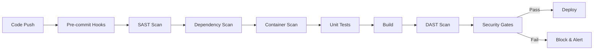

# 🔒 Scanning de Sécurité Automatique

## 🎯 Vue d'ensemble

Tous les scans de sécurité sont **OBLIGATOIRES** et bloquent le déploiement en cas de vulnérabilités critiques.

## 🔍 Types de Scans Obligatoires

### 1. SAST - Static Application Security Testing
```yaml
# ✅ OBLIGATOIRE - Sur chaque Pull Request
sast:
  tools:
    - name: "SonarQube"
      rules: "OWASP Top 10 + CWE Top 25"
      quality_gate: "Pass required"
      
    - name: "Semgrep"
      rulesets:
        - "p/security-audit"
        - "p/nodejs"
        - "p/owasp-top-ten"
        
    - name: "ESLint Security"
      plugins:
        - "eslint-plugin-security"
        - "eslint-plugin-security-node"
      
  blocking_issues:
    - "SQL Injection"
    - "XSS"
    - "Path Traversal"
    - "Command Injection"
    - "LDAP Injection"
    - "XXE"
    - "Insecure Deserialization"
```

### Implementation GitHub Actions
```yaml
name: Security Scan
on: [pull_request]

jobs:
  sast:
    runs-on: ubuntu-latest
    steps:
      - uses: actions/checkout@v3
      
      - name: SonarQube Scan
        uses: sonarsource/sonarqube-scan-action@master
        env:
          SONAR_TOKEN: ${{ secrets.SONAR_TOKEN }}
          
      - name: Semgrep Scan
        uses: returntocorp/semgrep-action@v1
        with:
          config: >-
            p/security-audit
            p/nodejs
            p/owasp-top-ten
            
      - name: ESLint Security
        run: |
          npm install -D eslint-plugin-security
          npx eslint . --ext .js,.ts --plugin security
```

### 2. Dependency Scanning
```javascript
// ✅ OBLIGATOIRE - Scan quotidien + sur chaque PR
{
  "scripts": {
    "audit": "npm audit --audit-level=moderate",
    "audit:fix": "npm audit fix",
    "audit:production": "npm audit --production",
    "check:licenses": "license-checker --onlyAllow 'MIT;Apache-2.0;BSD-3-Clause;BSD-2-Clause;ISC'",
    "snyk:test": "snyk test",
    "snyk:monitor": "snyk monitor"
  }
}

// Configuration Snyk
{
  "version": "1.0.0",
  "patches": {},
  "ignore": {},
  "severity": "medium",
  "failThreshold": "high"
}
```

### Automatisation avec Renovate
```json
{
  "extends": [
    "config:base",
    ":dependencyDashboard",
    ":semanticCommits",
    "group:allNonMajor",
    "schedule:earlyMondays"
  ],
  "vulnerabilityAlerts": {
    "enabled": true,
    "labels": ["security"],
    "assignees": ["@security-team"]
  },
  "packageRules": [
    {
      "matchUpdateTypes": ["patch"],
      "automerge": true
    },
    {
      "matchDepTypes": ["devDependencies"],
      "automerge": true
    }
  ]
}
```

### 3. Container Scanning
```dockerfile
# ✅ OBLIGATOIRE - Scan avant chaque déploiement
FROM node:18-alpine AS scanner

# Installation de Trivy
RUN apk add --no-cache curl \
    && curl -sfL https://raw.githubusercontent.com/aquasecurity/trivy/main/contrib/install.sh | sh -s -- -b /usr/local/bin

# Scan de l'image
RUN trivy image --severity HIGH,CRITICAL --exit-code 1 node:18-alpine

FROM node:18-alpine AS production
# ... reste du Dockerfile
```

### GitHub Actions pour Container Scanning
```yaml
- name: Run Trivy vulnerability scanner
  uses: aquasecurity/trivy-action@master
  with:
    image-ref: 'attitudes-api:${{ github.sha }}'
    format: 'sarif'
    output: 'trivy-results.sarif'
    severity: 'CRITICAL,HIGH'
    exit-code: '1'
    
- name: Upload Trivy scan results
  uses: github/codeql-action/upload-sarif@v2
  with:
    sarif_file: 'trivy-results.sarif'
```

### 4. Secret Detection
```yaml
# ✅ OBLIGATOIRE - Pre-commit hooks + CI
secret_scanning:
  tools:
    - name: "GitLeaks"
      config: ".gitleaks.toml"
      
    - name: "TruffleHog"
      entropy: true
      regex: true
      
    - name: "detect-secrets"
      baseline: ".secrets.baseline"
```

### Configuration GitLeaks
```toml
[allowlist]
description = "Attitudes.vip GitLeaks Config"
paths = [
  '''\.test\.js$''',
  '''\.spec\.js$''',
  '''fixtures'''
]

[[rules]]
description = "AWS Access Key"
regex = '''AKIA[0-9A-Z]{16}'''
tags = ["aws", "credentials"]

[[rules]]
description = "Private Key"
regex = '''-----BEGIN (RSA|DSA|EC|OPENSSH) PRIVATE KEY-----'''
tags = ["key", "private"]

[[rules]]
description = "Stripe API Key"
regex = '''sk_(test|live)_[0-9a-zA-Z]{24}'''
tags = ["stripe", "payment"]
```

### Pre-commit Hook
```yaml
# .pre-commit-config.yaml
repos:
  - repo: https://github.com/zricethezav/gitleaks
    rev: v8.16.1
    hooks:
      - id: gitleaks
        
  - repo: https://github.com/Yelp/detect-secrets
    rev: v1.4.0
    hooks:
      - id: detect-secrets
        args: ['--baseline', '.secrets.baseline']
```

### 5. DAST - Dynamic Application Security Testing
```javascript
// ✅ OBLIGATOIRE - Tests de sécurité runtime
const ZAP = require('zaproxy');

const dastConfig = {
  proxy: 'http://localhost:8080',
  target: process.env.TEST_URL || 'https://staging.attitudes.vip',
  
  scanPolicies: [
    'SQL Injection',
    'Cross Site Scripting',
    'Path Traversal',
    'Remote File Inclusion',
    'Server Side Include',
    'Script Active Scan Rules',
    'Server Security Misconfiguration'
  ],
  
  authentication: {
    method: 'json',
    loginUrl: '/api/auth/login',
    credentials: {
      email: process.env.TEST_USER,
      password: process.env.TEST_PASSWORD
    }
  }
};

async function runDAST() {
  const zap = new ZAP(dastConfig.proxy);
  
  // Spider pour découvrir les endpoints
  await zap.spider.scan(dastConfig.target);
  
  // Active scan
  await zap.ascan.scan(dastConfig.target);
  
  // Attendre la fin du scan
  while (await zap.ascan.status() < 100) {
    await sleep(5000);
  }
  
  // Récupérer les résultats
  const alerts = await zap.core.alerts();
  
  // Analyser les résultats
  const criticalAlerts = alerts.filter(a => a.risk === 'High' || a.risk === 'Critical');
  
  if (criticalAlerts.length > 0) {
    console.error('❌ Vulnérabilités critiques détectées:', criticalAlerts);
    process.exit(1);
  }
}
```

## 📊 SLA de Correction

### ✅ OBLIGATOIRE - Délais Maximum
```yaml
remediation_sla:
  critical:
    severity_score: "CVSS >= 9.0"
    max_time: "24 heures"
    escalation: "Immédiate au CTO"
    
  high:
    severity_score: "CVSS 7.0-8.9"
    max_time: "72 heures"
    escalation: "Après 48h"
    
  medium:
    severity_score: "CVSS 4.0-6.9"
    max_time: "1 semaine"
    escalation: "Après 5 jours"
    
  low:
    severity_score: "CVSS < 4.0"
    max_time: "1 mois"
    escalation: "Si non résolu au sprint suivant"
```

## 🔄 Pipeline de Sécurité Complet



### Implementation complète
```yaml
name: Security Pipeline
on: [push, pull_request]

jobs:
  security-checks:
    runs-on: ubuntu-latest
    steps:
      # 1. Checkout
      - uses: actions/checkout@v3
        with:
          fetch-depth: 0
          
      # 2. Secret Scanning
      - name: Gitleaks
        uses: gitleaks/gitleaks-action@v2
        env:
          GITHUB_TOKEN: ${{ secrets.GITHUB_TOKEN }}
          
      # 3. SAST
      - name: SonarQube
        uses: sonarsource/sonarqube-scan-action@master
        env:
          SONAR_TOKEN: ${{ secrets.SONAR_TOKEN }}
          
      - name: Semgrep
        uses: returntocorp/semgrep-action@v1
        with:
          generateSarif: true
          
      # 4. Dependency Scanning  
      - name: NPM Audit
        run: npm audit --production --audit-level=high
        
      - name: Snyk
        uses: snyk/actions/node@master
        env:
          SNYK_TOKEN: ${{ secrets.SNYK_TOKEN }}
          
      # 5. License Check
      - name: License Scanner
        run: |
          npm install -g license-checker
          license-checker --onlyAllow 'MIT;Apache-2.0;BSD-3-Clause;ISC'
          
      # 6. Container Scan (if applicable)
      - name: Build Image
        run: docker build -t attitudes-api:${{ github.sha }} .
        
      - name: Trivy Scan
        uses: aquasecurity/trivy-action@master
        with:
          image-ref: attitudes-api:${{ github.sha }}
          severity: CRITICAL,HIGH
          exit-code: 1
          
      # 7. Upload Results
      - name: Upload SARIF
        uses: github/codeql-action/upload-sarif@v2
        if: always()
        with:
          sarif_file: semgrep.sarif
```

## 📈 Métriques de Sécurité

### ✅ OBLIGATOIRE - KPIs à Suivre
```javascript
const securityMetrics = {
  // Temps de résolution moyen
  mttr: {
    critical: '< 24h',
    high: '< 72h',
    medium: '< 7 jours',
    low: '< 30 jours'
  },
  
  // Couverture des scans
  scanCoverage: {
    sast: '100% du code',
    dependencies: '100% des packages',
    containers: '100% des images',
    secrets: '100% des commits'
  },
  
  // Taux de faux positifs
  falsePositiveRate: '< 10%',
  
  // Vulnérabilités par mois
  vulnerabilityTrend: 'Décroissant',
  
  // Compliance
  complianceScore: '> 95%'
};
```

## 🚨 Processus d'Incident

### En cas de vulnérabilité critique
1. **Notification immédiate** à l'équipe sécurité
2. **Isolation** du système affecté si nécessaire
3. **Analyse d'impact** dans les 2 heures
4. **Plan de remédiation** dans les 4 heures
5. **Fix déployé** dans les 24 heures
6. **Post-mortem** dans les 48 heures

## 📋 Checklist de Sécurité

### Pour chaque PR
- [ ] Pas de secrets détectés
- [ ] SAST passé sans erreurs critiques
- [ ] Dependencies à jour et sans vulnérabilités
- [ ] Tests de sécurité passés
- [ ] Code review sécurité effectuée

### Pour chaque Release
- [ ] Scan DAST complet
- [ ] Penetration test (trimestriel)
- [ ] Audit des permissions
- [ ] Revue des logs de sécurité
- [ ] Mise à jour de la documentation

## 🛡️ Exceptions

Les exceptions aux règles de sécurité doivent être:
1. Documentées avec justification
2. Approuvées par le Security Officer
3. Limitées dans le temps (max 30 jours)
4. Compensées par des contrôles alternatifs
5. Revues régulièrement

---

**La sécurité n'est pas une option, c'est une obligation!** 🔐